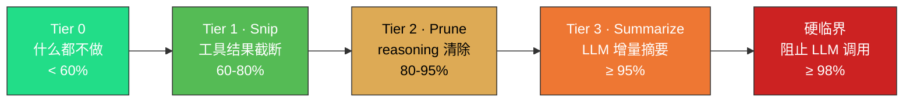

<p align="center">
  <a href="./docs/README.en.md">English</a>
  &nbsp;·&nbsp;
  <strong>简体中文</strong>
</p>

<p align="center">
  
</p>

<p align="center">
  <a href="https://github.com/Menfre01/waveloom/releases/latest"></a>
  <a href="https://go.dev"></a>
  <a href="https://platform.deepseek.com"></a>
  <a href="./LICENSE"></a>
  <a href="https://github.com/charmbracelet/bubbletea"></a>
  <a href="#"></a>
</p>

---

**Waveloom** 是一个终端 Code Agent（纯 Go），用自然语言操控代码库——读代码、搜符号、改文件、跑命令，全部在 TUI 中完成。

如果你用过 Claude Code 或 Codex CLI，Waveloom 的关键区别是：**专为 DeepSeek 前缀缓存深度优化，输入成本低两个数量级**（1/50 ~ 1/120），且已有的 Claude Code Skill **零迁移直接复用**。

> [!IMPORTANT]
> - Agent 写入文件和执行命令前需要你确认，不会静默操作。
> - Waveloom 不中转代码：API Key 直连 DeepSeek / OpenAI，你的代码不会经过第三方服务器。
> - 目前处于 **Alpha 阶段**，功能可能不稳定，欢迎通过 [Issue](https://github.com/Menfre01/waveloom/issues) 反馈。

---

## 快速开始

需要 [DeepSeek API Key](https://platform.deepseek.com/api_keys)。

**Homebrew（推荐）**

```sh
brew trust menfre01/tap && brew install Menfre01/tap/waveloom
```

**curl 一键安装**

```sh
curl -fsSL https://raw.githubusercontent.com/Menfre01/waveloom/main/install.sh | sh
```

> 安装到 `~/.local/bin`，无需 sudo。若该路径不在 PATH 中：`export PATH="$HOME/.local/bin:$PATH"` 并写入 `~/.bashrc` / `~/.zshrc`。

**启动**

```sh
waveloom setup                # 配置 API Key（只需一次）
waveloom                      # 启动 TUI
waveloom "解释这段代码"         # 单次执行
```

其他安装方式（分架构 curl、源码构建）及 shell 补全详见 [`docs/install.md`](./docs/install.md)。

---

<p align="center">
  
</p>

<p align="center">
  <sub>
    <b>重构代码</b> · 抽模块、去重复、改架构 &nbsp;&nbsp;|&nbsp;&nbsp;
    <b>排查 Bug</b> · 定位调用链、分析日志、找根因 &nbsp;&nbsp;|&nbsp;&nbsp;
    <b>写测试</b> · 补单测、造 mock、覆盖边界场景 &nbsp;&nbsp;|&nbsp;&nbsp;
    <b>解释代码</b> · 画出架构图、梳理数据流、讲设计意图
  </sub>
</p>

## 为什么选择 Waveloom

<p align="center">
  <a href="./docs/prefix-cache.md"></a>
  &nbsp;
  <a href="./docs/prefix-cache.md"></a>
</p>

<br/>

**🎯 专为 DeepSeek 前缀缓存打造。** System Prompt 固定为 `messages[0]`，消息历史跨轮累积不重置，压缩后字节永不变化。最大公共前缀持续命中缓存，同样任务输入成本仅为通用实现的 **1/50 ~ 1/120**。

**🧠 四级水位线自动压缩。** 60% Snip → 80% Prune → 95% Summarize → 98% 硬截断。百万 Token 上下文窗口自动管理，长对话不丢关键信息，不发生 Context Rot。

**🔍 LSP 原生集成。** 内置 LSP Client，Agent 主动调用 `lsp_diagnostic` / `lsp_definition` / `lsp_references` / `lsp_hover`，像你一样跳转定义、查找引用、查看类型签名。

**🛡️ 权限安全模型。** 三级决策（allow / deny / ask），规则引擎支持 `bash(ls *)` 等模式匹配。每次写文件和命令执行都需要你确认，不会静默发生。

**💻 终端原生 TUI。** 基于 [Bubble Tea](https://github.com/charmbracelet/bubbletea) v2 + [Glamour](https://github.com/charmbracelet/glamour) + [Lipgloss](https://github.com/charmbracelet/lipgloss)，流式渲染 thought / text / tool 输出，折叠展开全程透明。

**🔌 兼容 Claude Code Skill。** 自动加载 `~/.claude/skills/` 已有 Skill，零迁移成本。不是 Claude Code 的替代品——而是你已有的 Skill 可以直接在 Waveloom 里跑。

**🔄 会话持久恢复。** 每个会话自动保存完整状态。关闭终端、几天后再 `waveloom --continue` 回来，Agent 记得之前的所有上下文，接着上次继续工作。

**📦 零依赖单二进制。** 纯 Go，预编译 ~17MB，`curl` 一行安装。macOS / Linux AMD64 & ARM64 全支持。

---

## 上下文管理与前缀缓存

DeepSeek 前缀缓存对比 `messages[0]` 起点找最长公共前缀，缓存命中价格仅为未命中的 **1/50 ~ 1/120**。Waveloom 通过固定 System Prompt 起点、跨轮累积消息历史、四级水位线压缩（Snip → Prune → Summarize → 硬截断），确保压缩后的字节永不变化，缓存命中率稳定在 **95-99%**。



详见 [`docs/prefix-cache.md`](./docs/prefix-cache.md)。

---

## 其他安装方式

分架构手动下载、源码构建（`go install`）、Shell 补全配置详见 [`docs/install.md`](./docs/install.md)。

---

## Agent 能做什么

Waveloom 内置 14 个工具，Agent 根据任务自主调用：

| 🔍 理解代码 | ✏️ 修改代码 | ⚡ 执行操作 |
|:---:|:---:|:---:|
| `read_file` 读取文件 | `write_file` 创建/覆盖文件 | `shell` 执行 Shell 命令 |
| `grep` 搜索匹配行 | `edit_file` 精确字符串替换 | `web_fetch` 获取在线文档 |
| `search_file` 文件名查找 | `skill` 调用用户 Skill | `ask_user_question` 向用户发选择题 |
| `ls` 列出目录 | `lsp_diagnostic` 编译错误/警告 | |
| `lsp_definition` 跳转定义 | | |
| `lsp_references` 查找引用 | | |
| `lsp_hover` 类型签名/文档 | | |

> **LSP 前置条件**：LSP 工具需要对应语言的 LSP Server 在 PATH 中可用。对于 Go 项目，请确保安装了 [gopls](https://pkg.go.dev/golang.org/x/tools/gopls)（`go install golang.org/x/tools/gopls@latest`）。Agent 在首次调用 LSP 工具时会自动启动 LSP Server。

### Skill 系统

Waveloom 兼容 Claude Code Skill 格式，自动加载 `~/.claude/skills/` 目录中已有 Skill，无需任何迁移。创建 Skill 只需在目录下放置 `SKILL.md`，用 YAML frontmatter 声明参数和权限，Agent 通过 `/skill-name` 调用：

```
~/.claude/skills/deploy/
└── SKILL.md          # frontmatter + body，支持 $ARGUMENTS 变量替换
```

Skill 支持 `!` 动态命令注入、`allowed-tools` Bash 白名单、`paths` 条件激活。

典型场景：给你写单元测试、重构一个模块、排查 bug、解释某段代码的设计意图、添加新功能。

---

## 使用方式

```sh
waveloom                      # 交互式 TUI 模式
waveloom setup                # 首次配置向导
waveloom "解释 pkg/llm/client.go 的设计"  # 单次执行
waveloom ls                   # 列出最近会话
waveloom --continue           # 恢复最近一次会话
waveloom --resume <id>        # 恢复指定会话
```

交互模式下支持以下操作：

| 快捷键 / 操作 | 效果 |
|-------------|------|
| Enter（空闲时） | 发送输入 |
| Esc | 中断 Agent；空闲时双击清空输入 |
| `Tab` / `Shift+Tab` | 段落间导航 |
| Enter（聚焦段落时） | 展开 / 折叠 thought 或工具输出面板 |
| `Ctrl+G` | 暗色 / 亮色 / 自动 主题切换 |
| `Ctrl+E` / `End` | 跳到底部 |
| `↑↓`（空闲时） | 浏览输入历史 |
| `@path/to/file` | 内联引用文件内容 |
| `@` | 弹出文件选择器，模糊过滤 + `Tab` 进子目录 |
| `/` | 弹出命令选择器（/new /model /theme /help），支持模糊匹配 |
| `exit` | 退出程序 |

详见 [`docs/usage.md`](./docs/usage.md)。

---

## 权限安全

Agent 执行写操作或 Shell 命令前会经过权限检查。每个工具调用产生三种决策之一：

- **允许（allow）**：直接放行（只读操作默认允许）
- **拒绝（deny）**：硬拦截（如 `rm -rf /`）
- **询问（ask）**：弹出确认框，你来决定

<p align="center">
  
</p>

在 `settings.json` 中配置权限规则（文件位置：`~/.waveloom/settings.json` 或项目根目录 `.waveloom/settings.json`）：

```json
{
  "permissions": {
    "allow": ["read_file", "search_file", "grep", "ls"],
    "deny":  ["bash(rm -rf /*)"],
    "ask":   ["write_file", "edit_file"]
  }
}
```

规则格式：`工具名` 或 `工具名(匹配模式)`，如 `bash(ls *)` 匹配所有以 `ls ` 开头的命令。

CI / 自动化场景可用 `--bypass-permissions` 跳过所有检查。

---

## 配置

首次运行自动生成 `.waveloom/settings.json`，最简配置只需 API Key：

```json
{
  "llm": {
    "api_key": "sk-your-deepseek-key"
  }
}
```

完整配置项（模型、provider、超时、重试、压缩水位线、工具超时等）及 CLI 参数详见 [`docs/settings.md`](./docs/settings.md)。

---

## 常见问题

**Q: API Key 从哪里获取？**
前往 [platform.deepseek.com/api_keys](https://platform.deepseek.com/api_keys) 创建，然后运行 `waveloom setup` 配置。

**Q: 怎么切换模型？**
交互模式下输入 `/model` 选择，或启动时 `waveloom --model deepseek-v4-flash`。

**Q: 关掉终端后能恢复之前的对话吗？**
可以。`waveloom --continue` 恢复最近会话，`waveloom --resume <id>` 恢复指定会话，`waveloom ls` 列出所有历史会话。

更多问题详见 [`docs/faq.md`](./docs/faq.md)。

---

## 开发

需要 Go 1.25+。

```sh
make build       # 编译 → bin/waveloom
make install     # 安装 → $HOME/go/bin/waveloom
make test        # 测试
```

```
waveloom/
├── cmd/waveloom/          # 入口 + TUI
├── pkg/
│   ├── agentloop/         # Think-Act-Observe 循环
│   ├── compaction/        # 四级水位线上下文压缩
│   ├── context/           # 上下文累积
│   ├── environment/       # 编译/运行时工具链探测
│   ├── llm/               # LLM API 封装
│   ├── memory/            # AGENTS.md 层级加载
│   ├── permission/        # 权限守门人
│   ├── reference/         # @ 文件引用展开
│   └── tool/              # 内置工具
├── specs/                 # 各组件设计规格书
├── docs/                  # 文档
└── Makefile
```

---

Apache License 2.0
