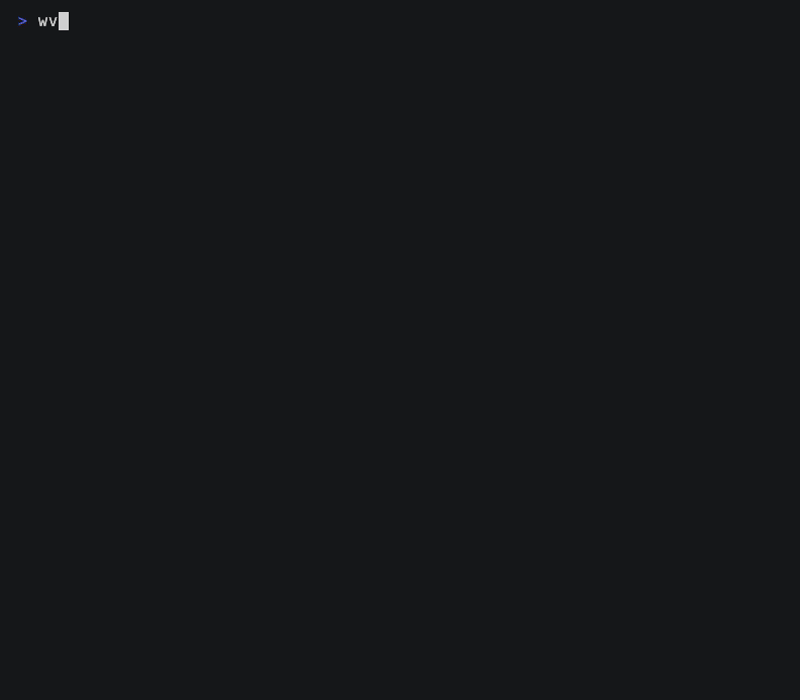
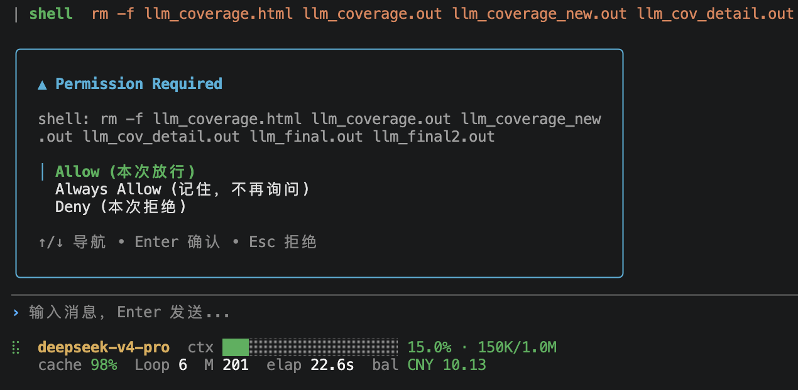
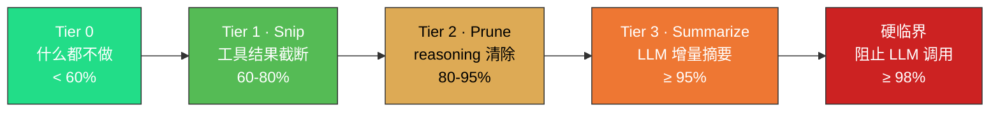

<p align="center">
  <a href="./docs/README.en.md">English</a>
  &nbsp;·&nbsp;
  <strong>简体中文</strong>
</p>

<p align="center">
  
</p>

<p align="center">
  <a href="https://github.com/Menfre01/waveloom/releases/latest"></a>
  <a href="https://go.dev"></a>
  <a href="https://platform.deepseek.com"></a>
  <a href="./LICENSE"></a>
  <a href="https://github.com/charmbracelet/bubbletea"></a>
  <a href="#"></a>
</p>

---

**Waveloom** 是为 **DeepSeek 前缀缓存定制的终端 Code Agent**（纯 Go）。通过固定 System Prompt 起点、跨轮累积消息和不可变压缩策略，将上下文缓存命中率推高到 **95-99%**，输入 Token 成本降至未命中的 **1/50 ~ 1/120**。

你用自然语言描述需求，Agent 在终端里读取代码、分析逻辑、编辑文件、执行命令——每一次写入和命令执行都先征求你的同意。首推 `deepseek-v4-pro`，同时兼容 `deepseek-v4-flash` 和 OpenAI 接口。

> [!IMPORTANT]
> **安全透明**：Agent 写文件和执行命令前必须经过你确认，不会静默操作。**需要 API Key**：前往 [DeepSeek](https://platform.deepseek.com/api_keys) 获取，然后运行 `waveloom setup` 完成配置。

---

<p align="center">
  
</p>

## 为什么选择 Waveloom

| 维度 | Waveloom 的做法 | 为什么重要 |
|------|----------------|-----------|
| **终端原生 TUI** | 基于 [Bubble Tea](https://github.com/charmbracelet/bubbletea) v2 + [Glamour](https://github.com/charmbracelet/glamour) Markdown 渲染 + [Lipgloss](https://github.com/charmbracelet/lipgloss) 样式引擎 | 流式渲染 thought / text / tool 输出，支持折叠展开，不是"黑盒聊天"，全程透明可审查 |
| **DeepSeek 前缀缓存优化** | System Prompt 固定为 `messages[0]`，消息历史跨轮累积不重置，压缩后字节永不变化 | 最大公共前缀持续命中，缓存命中价格仅为未命中的 **1/50 ~ 1/120** |
| **四级水位线上下文压缩** | 60% → Snip（工具结果截断）、80% → Prune（reasoning 清除 + 占位符）、95% → Summarize（LLM 增量摘要）、98% → 硬截断 | 自动管理百万 Token 上下文窗口，长对话不丢关键信息，不留垃圾，不发生 Context Rot |
| **LSP 原生集成** | 内置 LSP Client，Agent 可主动调用 `lsp_diagnostic` / `lsp_definition` / `lsp_references` / `lsp_hover` | Agent 像你一样理解代码——跳转定义、查找引用、查看类型签名，不是盲人摸象 |
| **权限安全模型** | 三级决策（allow / deny / ask），规则引擎支持 `shell(git *)` 等模式匹配，支持 CI `--bypass-permissions` | 你始终握有最终决定权，写文件和命令执行不会静默发生 |
| **单二进制部署** | 纯 Go，零运行时依赖，预编译二进制 ~15MB | `curl` 一行命令安装，macOS / Linux AMD64 & ARM64 全支持 |

---

## 安装

依赖：[DeepSeek API Key](https://platform.deepseek.com/api_keys)。

**macOS**

Apple Silicon（M1/M2/M3）：

```sh
mkdir -p ~/.local/bin && curl -fsSL https://github.com/Menfre01/waveloom/releases/latest/download/waveloom_darwin_arm64.tar.gz | tar -xz -C ~/.local/bin waveloom
```

Intel Mac：

```sh
mkdir -p ~/.local/bin && curl -fsSL https://github.com/Menfre01/waveloom/releases/latest/download/waveloom_darwin_amd64.tar.gz | tar -xz -C ~/.local/bin waveloom
```

**Linux**

x86_64：

```sh
mkdir -p ~/.local/bin && curl -fsSL https://github.com/Menfre01/waveloom/releases/latest/download/waveloom_linux_amd64.tar.gz | tar -xz -C ~/.local/bin waveloom
```

ARM64：

```sh
mkdir -p ~/.local/bin && curl -fsSL https://github.com/Menfre01/waveloom/releases/latest/download/waveloom_linux_arm64.tar.gz | tar -xz -C ~/.local/bin waveloom
```

**Homebrew（macOS / Linux）**

```sh
brew install Menfre01/tap/waveloom
```

> 若提示 "untrusted tap"，执行 `brew trust menfre01/tap` 后重试。

**安装后**

```sh
waveloom setup                # 首次配置 API Key（只需一次）
waveloom                      # 启动交互式 TUI
waveloom "解释这段代码"         # 或单次执行模式
```

**Shell 补全**

```sh
# bash
source <(waveloom completion bash)
# zsh
source <(waveloom completion zsh)
# fish
waveloom completion fish > ~/.config/fish/completions/waveloom.fish
```

> 支持 macOS / Linux AMD64 & ARM64。安装到 `~/.local/bin`，无需 sudo。若该路径不在 PATH 中，执行 `export PATH="$HOME/.local/bin:$PATH"` 并写入 `~/.bashrc` 或 `~/.zshrc`。升级只需重新执行安装命令；从源码构建：`git pull && make install`。详见 [`docs/install.md`](./docs/install.md)。

### Agent 一键安装

将以下 prompt 粘贴到任意 Coding Agent 中，Agent 会自动完成安装：

````markdown
Install waveloom on this machine:

1. Detect OS and architecture (`uname -sm`).
2. Download the latest binary from https://github.com/Menfre01/waveloom/releases/latest based on architecture:
   - macOS arm64: `waveloom_darwin_arm64.tar.gz`
   - macOS amd64: `waveloom_darwin_amd64.tar.gz`
   - Linux amd64: `waveloom_linux_amd64.tar.gz`
   - Linux arm64: `waveloom_linux_arm64.tar.gz`
3. Extract and install to ~/.local/bin:
   `mkdir -p ~/.local/bin && curl -fsSL <URL> | tar -xz -C ~/.local/bin waveloom`
4. Verify: `waveloom --version`
5. Remind the user to run `waveloom setup` to configure their DeepSeek API Key.
````

---

## Agent 能做什么

Waveloom 内置以下工具，Agent 根据任务自主调用：

| 工具 | 能力 |
|------|------|
| `read_file` | 读取文件内容 |
| `write_file` | 创建或覆盖文件 |
| `edit_file` | 精确替换文件中某段内容 |
| `grep` | 在代码库中搜索匹配的行 |
| `search_file` | 按文件名模式查找文件 |
| `ls` | 列出目录内容 |
| `shell` | 执行任意 Shell 命令 |
| `web_fetch` | 获取在线文档、API 参考 |
| `ask_user_question` | 向用户发起选择题（单选/多选/自定义输入） |
| `skill` | 调用用户安装的 Skill（`/skill-name`） |
| `lsp_diagnostic` | 获取文件编译错误和 lint 提示 |
| `lsp_definition` | 跳转到符号定义 |
| `lsp_references` | 查找符号的所有引用位置 |
| `lsp_hover` | 获取符号类型签名和文档 |

> **LSP 前置条件**：LSP 工具需要对应语言的 LSP Server 在 PATH 中可用。对于 Go 项目，请确保安装了 [gopls](https://pkg.go.dev/golang.org/x/tools/gopls)（`go install golang.org/x/tools/gopls@latest`）。Agent 在首次调用 LSP 工具时会自动启动 LSP Server。

### Skill 系统

通过 Skill 扩展 Agent 能力——在 `~/.claude/skills/` 下创建 `SKILL.md`，用 YAML frontmatter 声明参数和权限，Agent 通过 `/skill-name` 调用：

```
~/.claude/skills/deploy/
└── SKILL.md          # frontmatter + body，支持 $ARGUMENTS 变量替换
```

Skill 支持 `!` 动态命令注入、`allowed-tools` Bash 白名单、`paths` 条件激活。

典型场景：给你写单元测试、重构一个模块、排查 bug、解释某段代码的设计意图、添加新功能。

---

## 使用方式

```sh
waveloom                      # 交互式 TUI 模式
waveloom setup                # 首次配置向导
waveloom "解释 pkg/llm/client.go 的设计"  # 单次执行
waveloom ls                   # 列出最近会话
waveloom --continue           # 恢复最近一次会话
waveloom --resume <id>        # 恢复指定会话
```

交互模式下 Enter 发送、Esc 中断、`Tab` / `Shift+Tab` 聚焦可交互段落、Enter 展开/折叠、`Ctrl+G` 切换主题。输入 `@` 弹出文件选择器，支持模糊匹配。详见 [`docs/usage.md`](./docs/usage.md)。

---

## 权限安全

Agent 执行写操作或 Shell 命令前会经过权限检查。每个工具调用产生三种决策之一：

- **允许（allow）**：直接放行（只读操作默认允许）
- **拒绝（deny）**：硬拦截（如 `rm -rf /`）
- **询问（ask）**：弹出确认框，你来决定

<p align="center">
  
</p>

在 `settings.json` 中配置权限规则（文件位置：`~/.waveloom/settings.json` 或项目根目录 `.waveloom/settings.json`）：

```json
{
  "permissions": {
    "allow": ["read_file", "search_file", "grep", "ls"],
    "deny":  ["shell(rm -rf /*)"],
    "ask":   ["write_file", "edit_file"]
  }
}
```

规则格式：`工具名` 或 `工具名(匹配模式)`，如 `shell(git *)` 匹配所有以 `git ` 开头的命令。

CI / 自动化场景可用 `--bypass-permissions` 跳过所有检查。

---

## 配置

### settings.json

Waveloom 首次运行会在 `.waveloom/settings.json` 生成默认配置。最简配置只需要 `api_key`：

```json
{
  "llm": {
    "api_key": "sk-your-deepseek-key"
  }
}
```

完整的 `llm` 配置项（均有默认值，按需覆盖）：

| 字段 | 说明 | 默认值 |
|------|------|--------|
| `api_key` | DeepSeek API Key，为空时回退 `LLM_API_KEY` 环境变量 | — |
| `provider` | `deepseek` 或 `openai` | `deepseek` |
| `model` | 模型名 | `deepseek-v4-pro` |
| `base_url` | API 地址 | `https://api.deepseek.com` |
| `timeout` | 请求超时 | `600s` |
| `extra_params` | 额外参数（thinking、reasoning_effort 等） | 思考模式默认开启 |
| `retry` | 重试策略 `{"max_retries":3, "initial_backoff":"1s", "max_backoff":"30s", "multiplier":2.0}` | 默认重试策略 |
| `headers` | 自定义 HTTP 请求头 `{"X-Custom": "value"}` | — |

配置优先级：**CLI 参数 > `.waveloom/settings.json`（项目） > `~/.waveloom/settings.json`（全局）**

### 环境工具配置

Agent 启动时自动探测可用工具链。若工具不在 PATH 中或需指定版本，可通过 `environment.tools` 配置路径，详见 [`environment.md`](./docs/environment.md)。

### 上下文压缩配置

通过 `compaction` 块调整四级水位线参数（均有默认值，按需覆盖）：

| 字段 | 说明 | 默认值 |
|------|------|--------|
| `tier1_threshold` | Tier 1（Snip）触发阈值 | `0.6`（60%） |
| `tier2_threshold` | Tier 2（Prune）触发阈值 | `0.8`（80%） |
| `tier3_threshold` | Tier 3（Summarize）触发阈值 | `0.95`（95%） |
| `protection_zone_tokens` | 保护区 Token 数，支持 `"8K"` / `8000` | `8000` |
| `context_limit_tokens` | 模型上下文上限，支持 `"1M"` / `1000000` | `1000000` |

### 工具超时配置

通过 `tool_timeout` 字段控制单个工具执行的最大时长，防止工具因未正确响应取消信号而永久阻塞（优先级 CLI > 项目 > 全局，默认 10 分钟）：

| 字段 | 说明 | 默认值 |
|------|------|--------|
| `tool_timeout` | 单个工具执行超时（Go Duration 格式，如 `"10m"` / `"600s"` / `"0s"`，0 禁用） | `"10m"` |

### CLI 参数

| 参数 | 说明 | 默认值 |
|------|------|--------|
| `--model` | 模型名 | `deepseek-v4-pro` |
| `--system-prompt` | 自定义系统提示词 | 内置提示词 |
| `--max-turns N` | 最大轮数，0 不限制 | `0`（不限制） |
| `--context-limit 1M` | 上下文窗口大小，支持 `1M` / `200k` / 数字 | `1M` |
| `--theme auto/dark/light` | 主题，auto 自动检测终端背景 | `auto` |
| `--verbose` | 输出详细日志到 `.waveloom/waveloom.log` | 关闭 |
| `--bypass-permissions` | 跳过所有权限检查 | 关闭 |
| `--tool-timeout D` | 单个工具执行超时（Go Duration 格式，如 `10m` / `600s` / `0s`，0 禁用） | `10m` |
| `--resume ID` | 恢复指定会话 | — |
| `--continue` | 恢复最近一次会话 | — |
| `--settings PATH` | 指定配置文件路径 | `.waveloom/settings.json` |
| `--version` | 显示版本号 | — |

---

## 使用技巧

| 技巧 | 操作 |
|------|------|
| 切换主题 | `Ctrl+G` 在暗色 / 亮色 / 自动之间循环（自动模式跟随终端背景色） |
| 退出程序 | `Ctrl+C` 或输入 `exit` 回车 |
| 查看命令 | 输入 `/` 弹出命令选择器（/new /model /theme /help），↑↓ 导航，Enter 确认，Tab 补全 |
| 输入历史 | ↑↓ 空闲时浏览之前提交的输入 |
| 段落操作 | `Tab` / `Shift+Tab` 段落间导航，`Enter` 展开 / 折叠 |
| 跳到最新 | `Ctrl+E` 或 `End` 键跳到底部 |
| 中断 / 清空 | `Esc` 中断 Agent，空闲时双击 `Esc` 清空输入框 |
| 选中文本 | `Shift + 鼠标拖动` 跨面板选中终端中的任意文本 |
| 快速引用文件 | 输入 `@path/to/file` 内联引用文件内容，或输入 `@` 弹出文件选择器模糊过滤 + `Tab` 进入子目录 |

> `/`、`@`、`↑↓` 历史、段落导航、`exit` 仅在空闲时生效；`Ctrl+G`、`Ctrl+E`、`Ctrl+C`、`PgUp/PgDn`、`Esc` 可随时使用。
| 项目约定注入 | 启动时自动加载 `AGENTS.md`（全局 → 项目根 → CWD 层级拼接），作为第一条 user 消息注入上下文 |
| AGENTS.md 子文件 | `AGENTS.md` 内可用 `@path/to/file` 引用其他文件，内容自动展开合并（支持多文件、自动去重） |
| 恢复会话 | `waveloom --continue` 恢复最近会话，`waveloom --resume <id>` 恢复指定会话，`waveloom ls` 列出可选 ID |
| 查看日志 | `waveloom --verbose` 启动，日志在 `.waveloom/waveloom.log`，另一个终端 `tail -f` 实时查看 |

---

## 上下文管理与前缀缓存

DeepSeek 前缀缓存对比 `messages[0]` 起点找最长公共前缀，缓存命中价格仅为未命中的 **1/50 ~ 1/120**。Waveloom 通过固定 System Prompt 起点、跨轮累积消息历史、四级水位线压缩（Snip → Prune → Summarize → 硬截断），确保压缩后的字节永不变化，缓存命中率稳定在 **95-99%**。



详见 [`docs/prefix-cache.md`](./docs/prefix-cache.md)。

---

## 常见问题

常见安装、配置、使用问题详见 [`docs/faq.md`](./docs/faq.md)。

---

## 开发

需要 Go 1.25+。

```sh
make build       # 编译 → bin/waveloom
make install     # 安装 → $HOME/go/bin/waveloom
make test        # 测试
```

```
waveloom/
├── cmd/waveloom/          # 入口 + TUI
├── pkg/
│   ├── agentloop/         # Think-Act-Observe 循环
│   ├── compaction/        # 四级水位线上下文压缩
│   ├── context/           # 上下文累积
│   ├── environment/       # 编译/运行时工具链探测
│   ├── llm/               # LLM API 封装
│   ├── memory/            # AGENTS.md 层级加载
│   ├── permission/        # 权限守门人
│   ├── reference/         # @ 文件引用展开
│   └── tool/              # 内置工具
├── specs/                 # 各组件设计规格书
├── docs/                  # 文档
└── Makefile
```

---

Apache License 2.0
