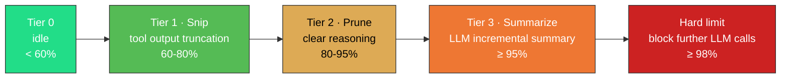

<p align="center">
  <strong>English</strong>
  &nbsp;·&nbsp;
  <a href="../README.md">简体中文</a>
</p>

<p align="center">
  
</p>

<p align="center">
  <a href="https://github.com/Menfre01/waveloom/releases/latest"></a>
  <a href="#"></a>
  <a href="#"></a>
  <a href="../LICENSE"></a>
  <a href="https://github.com/charmbracelet/bubbletea"></a>
  <a href="#"></a>
  <a href="https://github.com/Menfre01/waveloom/releases"></a>
</p>

---

**Waveloom** is a terminal Code Agent **purpose-built for DeepSeek prefix caching** (pure Go). It leverages DeepSeek's prefix cache mechanism — with a fixed System Prompt anchor, turn-accumulated message history, and compaction that never mutates bytes — to push context cache hit rates to **95–99%**, slashing input token costs to **1/50 ~ 1/120** of the cache-miss price.

You describe what you want in natural language. The agent reads code, analyzes logic, edits files, and executes commands — right in your terminal. Every write and command execution requires your consent first. Primary recommended model: `deepseek-v4-pro`. Also compatible with `deepseek-v4-flash` and OpenAI-compatible endpoints.

> [!IMPORTANT]
> **Safe & Transparent**: The agent always asks for confirmation before writing files or executing commands — nothing happens silently. **API Key Required**: Get one from [DeepSeek](https://platform.deepseek.com/api_keys), then run `wvl setup`.

---

## Why Waveloom

| Dimension | Waveloom's Approach | Why It Matters |
|-----------|-------------------|----------------|
| **Terminal-Native TUI** | Built on [Bubble Tea](https://github.com/charmbracelet/bubbletea) v2 + [Glamour](https://github.com/charmbracelet/glamour) Markdown rendering + [Lipgloss](https://github.com/charmbracelet/lipgloss) styling | Streaming rendering of thought/text/tool output with collapse/expand — not a "black box chat", fully transparent and reviewable |
| **DeepSeek Prefix Cache Optimization** | System prompt fixed as `messages[0]`, message history accumulated across turns without reset, compacted bytes never change | Maximum common prefix stays cache-hot; cache-hit token price is **1/50 ~ 1/120** of cache-miss |
| **Four-Tier Watermark Context Compaction** | 60% → Snip (tool output truncation), 80% → Prune (reasoning removal + placeholders), 95% → Summarize (LLM incremental summary), 98% → Hard cutoff | Automatic management of million-token context window — long conversations keep what matters, drop noise, and never suffer Context Rot |
| **Native LSP Integration** | Built-in LSP client; agent can proactively call `lsp_diagnostic` / `lsp_definition` / `lsp_references` / `lsp_hover` | Agent understands code like you do — jump to definitions, find references, inspect type signatures — not coding blind |
| **Permission Safety Model** | Three-tier decisions (allow / deny / ask), rule engine with pattern matching like `shell(git *)`, CI `--bypass-permissions` | You always have the final say; file writes and command execution never happen silently |
| **Single Binary Deployment** | Pure Go, zero runtime dependencies, ~15MB pre-built binary | One `curl` command to install; macOS / Linux AMD64 & ARM64 all supported |

---

## Install

Requires: [DeepSeek API Key](https://platform.deepseek.com/api_keys).

### Pre-built Binary (Recommended)

No Go required. Grab the right binary from [Releases](https://github.com/Menfre01/waveloom/releases/latest).

> `/usr/local/bin` requires sudo. Or use `~/.local/bin` instead (see fallback below).

```sh
# macOS (ARM64 — Apple Silicon)
sudo curl -fsSL https://github.com/Menfre01/waveloom/releases/latest/download/wvl_darwin_arm64.tar.gz | sudo tar -xz -C /usr/local/bin wvl

# macOS (AMD64 — Intel)
sudo curl -fsSL https://github.com/Menfre01/waveloom/releases/latest/download/wvl_darwin_amd64.tar.gz | sudo tar -xz -C /usr/local/bin wvl

# Linux (AMD64)
sudo curl -fsSL https://github.com/Menfre01/waveloom/releases/latest/download/wvl_linux_amd64.tar.gz | sudo tar -xz -C /usr/local/bin wvl

# Linux (ARM64)
sudo curl -fsSL https://github.com/Menfre01/waveloom/releases/latest/download/wvl_linux_arm64.tar.gz | sudo tar -xz -C /usr/local/bin wvl
```

> No write permission for `/usr/local/bin`? Install to `~/.local/bin`:
> ```sh
> mkdir -p ~/.local/bin
> curl -fsSL https://github.com/Menfre01/waveloom/releases/latest/download/wvl_darwin_arm64.tar.gz | tar -xz -C ~/.local/bin wvl
> export PATH="$HOME/.local/bin:$PATH"  # add to ~/.bashrc or ~/.zshrc
> ```
>
> macOS Gatekeeper? Allow it with:
> ```sh
> xattr -d com.apple.quarantine /usr/local/bin/wvl
> ```

### Build from Source

Prerequisites: **Go 1.25+**.

```sh
git clone https://github.com/Menfre01/waveloom.git
cd waveloom && make install
# wvl is installed to $HOME/go/bin — make sure it's on PATH:
export PATH=$HOME/go/bin:$PATH
```

### Update

**Pre-built binary**: re-run the install command to overwrite the old version.

**Build from source**:

```sh
cd waveloom && git pull && make install
```

### First-time Setup

```sh
# Interactive guide (once only)
wvl setup
# → Choose Provider → Enter API Key → Choose Model → Done

# Or skip config entirely with an env var:
LLM_API_KEY=sk-... wvl
```

### Quick Start

```sh
# 1. Install (macOS ARM64 example)
sudo curl -fsSL https://github.com/Menfre01/waveloom/releases/latest/download/wvl_darwin_arm64.tar.gz | sudo tar -xz -C /usr/local/bin wvl

# 2. First-time setup (once only)
wvl setup

# 3. Start using
wvl "Hello, tell me about yourself"
```

> Config is saved to `~/.waveloom/settings.json`. Project-level config can be placed at `.waveloom/settings.json`, with the same fields and higher priority than the global config.

---

## What the Agent Can Do

Waveloom has the following built-in tools that the agent invokes autonomously:

| Tool | Capability |
|------|------------|
| `read_file` | Read file contents |
| `write_file` | Create or overwrite files |
| `edit_file` | Exact string-based find-and-replace in files |
| `grep` | Search codebase for matching lines |
| `search_file` | Find files by name pattern |
| `ls` | List directory contents |
| `shell` | Execute arbitrary shell commands |
| `web_fetch` | Fetch online docs, API references |
| `lsp_diagnostic` | Get compile errors and lint hints |
| `lsp_definition` | Jump to symbol definition |
| `lsp_references` | Find all references to a symbol |
| `lsp_hover` | Get symbol type signature and documentation |

> **LSP Prerequisites**: LSP tools require the corresponding language server available in PATH. For Go projects, install [gopls](https://pkg.go.dev/golang.org/x/tools/gopls) (`go install golang.org/x/tools/gopls@latest`). The agent automatically starts the LSP server on first LSP tool invocation.

Typical use cases: writing unit tests, refactoring a module, debugging an issue, explaining design intent behind a piece of code, adding new features.

---

## Usage

### Interactive Mode

```sh
wvl
```

Once in the TUI, type like a chat and press Enter to send. The agent autonomously invokes tools to read files, search code, edit, and run tests.

<p align="center">
  
</p>

The prefix character at the beginning of each line tells you **who is speaking**:

| Prefix | Role | Meaning |
|--------|------|---------|
| `›` | You | Your message, in blue |
| `·` / spinner | Assistant | AI reply, in green, Markdown rendered |
| `·` / spinner | Thought | AI's reasoning, in gray, collapsed to one line when done (`Ctrl+T` to expand) |
| `•` / spinner | Tool | AI's actions (read, write, run), green = success / red = failure |

**Keyboard shortcuts**:

| Key | Action |
|-----|--------|
| `Enter` | Send message |
| `Esc` | Interrupt running agent |
| `↑` `↓` / `PgUp` `PgDn` | Scroll conversation history |
| `Ctrl+E` / `End` | Jump to bottom |
| `Ctrl+T` | Expand/collapse the most recent thought |
| `Ctrl+O` | Expand/collapse the most recent tool output |
| `Ctrl+G` | Toggle theme (dark / light / auto) |
| `Ctrl+V` | Paste |
| `Ctrl+C` | Quit |

The **footer status bar** shows: current model, context usage (progress bar), cache hit rate, loop count, latency, balance.

### One-shot

```sh
wvl "explain the design of pkg/llm/client.go"
wvl --model deepseek-v4-pro "write unit tests for UserService"
echo "review the code under pkg/llm/" | wvl
```

### Session Management

```sh
wvl ls                     # List recent sessions
wvl --continue             # Resume the most recent session
wvl --resume <session-id>  # Resume a specific session
```

### @ File References

Type `@` in the input to open a fuzzy file picker (prefix > substring matching). `Tab` enters subdirectories. Selected file contents are automatically injected into the message context.

```
help me optimize the error handling in @pkg/auth/login.go
```

---

## Permission & Safety

Before the agent performs a write operation or shell command, it goes through a permission check. Each tool invocation results in one of three decisions:

- **Allow**: Pass through directly (read-only operations are allowed by default)
- **Deny**: Hard block (e.g., `rm -rf /`)
- **Ask**: Show a confirmation dialog for you to decide

<p align="center">
  
</p>

Configure permission rules in `settings.json` (file location: `~/.waveloom/settings.json` or project root `.waveloom/settings.json`):

```json
{
  "permissions": {
    "allow": ["read_file", "search_file", "grep", "ls"],
    "deny":  ["shell(rm -rf /*)"],
    "ask":   ["write_file", "edit_file"]
  }
}
```

Rule format: `ToolName` or `ToolName(pattern)`, e.g., `shell(git *)` matches all commands starting with `git `.

For CI / automation scenarios, use `--bypass-permissions` to skip all checks.

---

## Configuration

### settings.json

On first run, Waveloom generates a default config at `.waveloom/settings.json`. The minimal config only requires `api_key`:

```json
{
  "llm": {
    "api_key": "sk-your-deepseek-key"
  }
}
```

Full `llm` configuration options (all have defaults, override as needed):

| Field | Description | Default |
|-------|-------------|---------|
| `api_key` | DeepSeek API Key, falls back to `LLM_API_KEY` env var when empty | — |
| `provider` | `deepseek` or `openai` | `deepseek` |
| `model` | Model name | `deepseek-v4-pro` |
| `base_url` | API endpoint | `https://api.deepseek.com` |
| `timeout` | Request timeout | `600s` |
| `extra_params` | Extra parameters (thinking, reasoning_effort, etc.) | Thinking mode on by default |

Priority: **CLI flags > `.waveloom/settings.json` (project) > `~/.waveloom/settings.json` (global)**

### CLI Flags

| Flag | Description |
|------|-------------|
| `--model` | Model name |
| `--system-prompt` | Custom system prompt |
| `--max-turns N` | Maximum turns, 0 = unlimited |
| `--context-limit 1M` | Context window size, supports `1M` / `200k` / raw number |
| `--theme auto/dark/light` | Theme, auto detects terminal background |
| `--verbose` | Log detailed output to `.waveloom/wvl.log` |
| `--bypass-permissions` | Skip all permission checks |
| `--resume ID` | Resume a specific session |
| `--continue` | Resume the most recent session |
| `--settings PATH` | Specify config file path |
| `--version` | Show version |

---

## Context Management & Prefix Caching

DeepSeek's prefix cache mechanism: on each request, the API compares `messages[0]` onward against the previous request, finding the longest common prefix. The cached portion is billed at the cache-hit rate; the remainder at the standard rate. **The price gap between cache-hit and cache-miss is massive** — for V4-Flash and V4-Pro, cache-hit price is just **1/50 ~ 1/120** of the cache-miss price.

Waveloom systematically optimizes for this:

1. **System prompt fixed as `messages[0]`**: The first message never changes, no matter how long the conversation — ensuring the prefix starting point is always stable.
2. **Message history accumulated across turns**: Each turn appends to the end rather than resetting. The first N-1 turns become the prefix for turn N's request.
3. **Four-tier watermark compaction (Tier 0–3)**: As context utilization rises, history is compressed in stages. The key insight — **compacted byte content never changes again**. Once a message is truncated or replaced with a placeholder, it keeps the exact same byte representation in all future turns, so the prefix cache keeps hitting.
4. **Monotonic boundary guarantee**: The decision table (`compactionDecisionSet`) + dual cursor mechanism ensures each message is compacted exactly once — never modified repeatedly, which would invalidate the cache.



Cache hit rates are typically **95–99%**, meaning in a 1M-token context window, only 10K–50K tokens are billed at the standard rate. This is not luck — it's by architectural design.

> See [`specs/compaction.md`](../specs/compaction.md) — complete design of context compaction.

---

## Troubleshooting

**Q: "command not found" when running `wvl`?**

The install path is not in PATH. Pre-built binaries install to `/usr/local/bin` by default — ensure it's in PATH. If installed to `~/.local/bin`, add `export PATH="$HOME/.local/bin:$PATH"` to `~/.bashrc` or `~/.zshrc`.

**Q: "api_key is required" error?**

No API Key detected. Run `wvl setup` to complete first-time configuration, or set the `LLM_API_KEY` environment variable. Config is written to `~/.waveloom/settings.json`.

**Q: macOS "cannot verify developer"?**

Run `xattr -d com.apple.quarantine /usr/local/bin/wvl` to remove the quarantine attribute.

**Q: How can I verify prefix caching is working?**

The TUI footer status bar shows the cache hit rate. You can also check `.waveloom/wvl.log` (requires `--verbose`) for `cache_hit_tokens` info.

**Q: LSP tools not working?**

Ensure the corresponding language server is installed and in PATH. For Go projects, install gopls: `go install golang.org/x/tools/gopls@latest`.

**Q: Do @ file references work in one-shot mode?**

`@` file references are currently only supported in TUI interactive mode. In one-shot mode, `@pkg/foo.go` is treated as plain text.

---

## Development

```sh
make build       # Build → bin/wvl
make install     # Install → $HOME/go/bin/wvl
make test        # Test
```

```
waveloom/
├── cmd/waveloom/          # Entry point + TUI
├── pkg/
│   ├── agentloop/         # Think-Act-Observe loop
│   ├── context/           # Context accumulation + four-tier watermark compaction
│   ├── llm/               # LLM API client
│   ├── memory/            # AGENTS.md hierarchical loading
│   ├── permission/        # Permission gatekeeper
│   ├── reference/         # @ file reference expansion
│   └── tool/              # Built-in tools
├── specs/                 # Component design specs
├── docs/                  # Documentation
└── Makefile
```

---

Apache License 2.0
