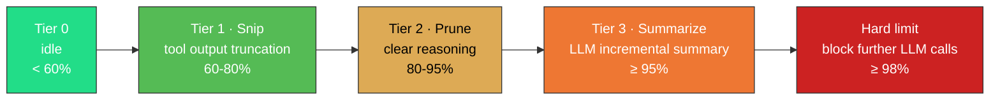

<p align="center">
  <strong>English</strong>
  &nbsp;·&nbsp;
  <a href="../README.md">简体中文</a>
</p>

<p align="center">
  
</p>

<p align="center">
  <a href="https://github.com/Menfre01/waveloom/releases/latest"></a>
  <a href="https://go.dev"></a>
  <a href="https://platform.deepseek.com"></a>
  <a href="../LICENSE"></a>
  <a href="https://github.com/charmbracelet/bubbletea"></a>
  <a href="#"></a>
</p>

---

**Waveloom** is a terminal Code Agent (pure Go) — read code, search symbols, edit files, run commands, all within a TUI, driven by natural language.

If you've used Claude Code or Codex CLI, here's the key difference: Waveloom is **deeply optimized for DeepSeek prefix caching — two orders of magnitude cheaper on input tokens** (1/50 ~ 1/120), and your existing Claude Code Skills **work out of the box with zero migration**.

> [!IMPORTANT]
> - The agent asks for confirmation before every file write and command execution — nothing happens silently.
> - Waveloom does **not** relay your code: API keys connect directly to DeepSeek / OpenAI, your code never passes through a third-party server.
> - Currently in **Alpha** — features may be unstable. Feedback is welcome via [Issues](https://github.com/Menfre01/waveloom/issues).

---

## Quick Start

Requires a [DeepSeek API Key](https://platform.deepseek.com/api_keys).

**Homebrew (recommended)**

```sh
brew trust menfre01/tap && brew install Menfre01/tap/waveloom
```

**curl one-liner**

```sh
curl -fsSL https://raw.githubusercontent.com/Menfre01/waveloom/main/install.sh | sh
```

> Installs to `~/.local/bin` — no sudo needed. If that directory isn't in PATH: `export PATH="$HOME/.local/bin:$PATH"` and add to `~/.bashrc` / `~/.zshrc`.

**Launch**

```sh
waveloom setup                # Configure API Key (once only)
waveloom                      # Launch TUI
waveloom "explain this code"  # One-shot query
```

For per-architecture downloads, building from source, and shell completions — see [`install.en.md`](./install.en.md).

---

<p align="center">
  
</p>

<p align="center">
  <sub>
    <b>Refactor</b> · extract modules, deduplicate, restructure &nbsp;&nbsp;|&nbsp;&nbsp;
    <b>Debug</b> · trace call chains, analyze logs, find root causes &nbsp;&nbsp;|&nbsp;&nbsp;
    <b>Write Tests</b> · unit tests, mocks, edge cases &nbsp;&nbsp;|&nbsp;&nbsp;
    <b>Explain Code</b> · draw architecture diagrams, trace data flow, explain design intent
  </sub>
</p>

## Why Waveloom

<p align="center">
  <a href="./prefix-cache.en.md"></a>
  &nbsp;
  <a href="./prefix-cache.en.md"></a>
</p>

<br/>

**🎯 Purpose-built for DeepSeek prefix caching.** System prompt fixed as `messages[0]`, message history accumulated across turns, compacted bytes never change. The maximum common prefix stays cache-hot — input cost is **1/50 ~ 1/120** of general-purpose implementations for the same workload.

**🧠 Four-tier watermark compaction.** 60% Snip → 80% Prune → 95% Summarize → 98% Hard cutoff. Automatic management of million-token context windows — long conversations keep what matters and never suffer Context Rot.

**🔍 Native LSP integration.** Built-in LSP client — agent proactively calls `lsp_diagnostic` / `lsp_definition` / `lsp_references` / `lsp_hover`, understanding code like you do.

**🛡️ Permission safety model.** Three-tier decisions (allow / deny / ask), rule engine with `bash(ls *)` pattern matching. Every file write and command execution requires your confirmation.

**💻 Terminal-native TUI.** Built on [Bubble Tea](https://github.com/charmbracelet/bubbletea) v2 + [Glamour](https://github.com/charmbracelet/glamour) + [Lipgloss](https://github.com/charmbracelet/lipgloss). Streaming render of thought/text/tool output with collapse/expand — transparent and reviewable.

**🔌 Claude Code Skill compatible.** Auto-loads existing skills from `~/.claude/skills/` — zero migration. Not a Claude Code replacement — your existing Skills just work in Waveloom.

**🔄 Persistent session resume.** Every session saves its full state automatically. Close the terminal, come back days later with `waveloom --continue` — the agent remembers all prior context and picks up right where you left off.

**📦 Single binary, zero dependencies.** Pure Go, ~17MB pre-built binary. One `curl` command to install. macOS / Linux AMD64 & ARM64 supported.

---

## Context Management & Prefix Caching

DeepSeek's prefix cache compares requests from `messages[0]` onward to find the longest common prefix — cache-hit price is just **1/50 ~ 1/120** of cache-miss. Waveloom optimizes for this with a fixed System Prompt anchor, turn-accumulated message history, and four-tier watermark compaction (Snip → Prune → Summarize → Hard cutoff) that never mutates compacted bytes, achieving **95–99%** cache hit rates.



See [`prefix-cache.en.md`](./prefix-cache.en.md) for details.

---

## Other Install Methods

Per-architecture downloads, building from source (`go install`), and shell completions — see [`install.en.md`](./install.en.md).

---

## What the Agent Can Do

Waveloom has 14 built-in tools that the agent invokes autonomously:

| 🔍 Understand Code | ✏️ Modify Code | ⚡ Execute Actions |
|:---:|:---:|:---:|
| `read_file` read files | `write_file` create/overwrite files | `shell` execute shell commands |
| `grep` search matching lines | `edit_file` precise find-and-replace | `web_fetch` fetch online docs |
| `search_file` find by filename | `skill` invoke user Skills | `ask_user_question` ask user via choices |
| `ls` list directory | `lsp_diagnostic` compile errors/warnings | |
| `lsp_definition` jump to definition | | |
| `lsp_references` find references | | |
| `lsp_hover` type signature/docs | | |

> **LSP Prerequisites**: LSP tools require the corresponding language server available in PATH. For Go projects, install [gopls](https://pkg.go.dev/golang.org/x/tools/gopls) (`go install golang.org/x/tools/gopls@latest`). The agent automatically starts the LSP server on first LSP tool invocation.

### Skill System

Waveloom is compatible with the Claude Code Skill format — existing skills under `~/.claude/skills/` are auto-loaded with zero migration. Create a Skill by placing a `SKILL.md` with YAML frontmatter for parameters and permissions, then invoke via `/skill-name`:

```
~/.claude/skills/deploy/
└── SKILL.md          # frontmatter + body, supports $ARGUMENTS variable substitution
```

Skills support `!` dynamic command injection, `allowed-tools` Bash whitelist, and `paths` conditional activation.

Typical use cases: writing unit tests, refactoring a module, debugging an issue, explaining design intent, adding new features.

---

## Usage

```sh
waveloom                      # Interactive TUI mode
waveloom setup                # First-time setup wizard
waveloom "explain the design of pkg/llm/client.go"  # One-shot
waveloom ls                   # List recent sessions
waveloom --continue           # Resume the most recent session
waveloom --resume <id>        # Resume a specific session
```

In interactive mode:

| Shortcut / Action | Effect |
|-------------------|--------|
| Enter (idle) | Send input |
| Esc | Interrupt agent; double-press when idle to clear input |
| `Tab` / `Shift+Tab` | Navigate between paragraphs |
| Enter (focused) | Expand / collapse thought or tool output panels |
| `Ctrl+G` | Cycle dark / light / auto theme |
| `Ctrl+E` / `End` | Jump to bottom |
| `↑↓` (idle) | Browse input history |
| `@path/to/file` | Inline file content reference |
| `@` | Fuzzy file picker; `Tab` to enter subdirectories |
| `/` | Command palette (/new /model /theme /help) with fuzzy matching |
| `exit` | Quit program |

See [`usage.en.md`](./usage.en.md) for details.

---

## Permission & Safety

Before the agent performs a write operation or shell command, it goes through a permission check. Each tool invocation results in one of three decisions:

- **Allow**: Pass through directly (read-only operations are allowed by default)
- **Deny**: Hard block (e.g., `rm -rf /`)
- **Ask**: Show a confirmation dialog for you to decide

<p align="center">
  
</p>

Configure permission rules in `settings.json` (file location: `~/.waveloom/settings.json` or project root `.waveloom/settings.json`):

```json
{
  "permissions": {
    "allow": ["read_file", "search_file", "grep", "ls"],
    "deny":  ["bash(rm -rf /*)"],
    "ask":   ["write_file", "edit_file"]
  }
}
```

Rule format: `ToolName` or `ToolName(pattern)`, e.g., `bash(ls *)` matches all commands starting with `ls `.

For CI / automation scenarios, use `--bypass-permissions` to skip all checks.

---

## Configuration

On first run, Waveloom generates a default config at `.waveloom/settings.json`. The minimal config only requires `api_key`:

```json
{
  "llm": {
    "api_key": "sk-your-deepseek-key"
  }
}
```

Full configuration options (model, provider, timeout, retry, compaction watermarks, tool timeout, etc.) and CLI flags — see [`settings.en.md`](./settings.en.md).

---

## Troubleshooting

**Q: Where do I get an API Key?**
Go to [platform.deepseek.com/api_keys](https://platform.deepseek.com/api_keys), create one, then run `waveloom setup`.

**Q: How do I switch models?**
Type `/model` in interactive mode, or start with `waveloom --model deepseek-v4-flash`.

**Q: Can I resume a session after closing the terminal?**
Yes. `waveloom --continue` resumes the latest session, `waveloom --resume <id>` resumes a specific one, `waveloom ls` lists all saved sessions.

More questions — see [`faq.en.md`](./faq.en.md).

---

## Development

Requires Go 1.25+.

```sh
make build       # Build → bin/waveloom
make install     # Install → $HOME/go/bin/waveloom
make test        # Test
```

```
waveloom/
├── cmd/waveloom/          # Entry point + TUI
├── pkg/
│   ├── agentloop/         # Think-Act-Observe loop
│   ├── compaction/        # Four-tier watermark context compaction
│   ├── context/           # Context accumulation
│   ├── environment/       # Build/runtime toolchain probing
│   ├── llm/               # LLM API client
│   ├── memory/            # AGENTS.md hierarchical loading
│   ├── permission/        # Permission gatekeeper
│   ├── reference/         # @ file reference expansion
│   └── tool/              # Built-in tools
├── specs/                 # Component design specs
├── docs/                  # Documentation
└── Makefile
```

---

Apache License 2.0
