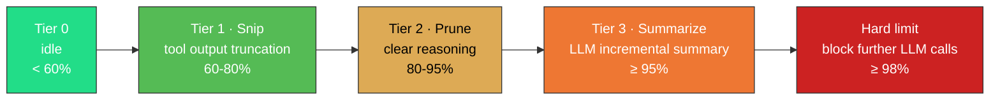

<p align="center">
  <strong>English</strong>
  &nbsp;·&nbsp;
  <a href="../README.md">简体中文</a>
</p>

<p align="center">
  
</p>

<p align="center">
  <a href="https://github.com/Menfre01/waveloom/releases/latest"></a>
  <a href="https://go.dev"></a>
  <a href="https://platform.deepseek.com"></a>
  <a href="../LICENSE"></a>
  <a href="https://github.com/charmbracelet/bubbletea"></a>
  <a href="#"></a>
</p>

---

**Waveloom** is a terminal Code Agent **purpose-built for DeepSeek prefix caching** (pure Go). With a fixed System Prompt anchor, turn-accumulated message history, and immutable compaction, it pushes context cache hit rates to **95–99%**, slashing input token costs to **1/50 ~ 1/120** of the cache-miss price.

You describe what you want in natural language. The agent reads code, analyzes logic, edits files, and executes commands — right in your terminal. Every write and command execution requires your consent first. Primary recommended model: `deepseek-v4-pro`. Also compatible with `deepseek-v4-flash` and OpenAI-compatible endpoints.

> [!IMPORTANT]
> **Safe & Transparent**: The agent always asks for confirmation before writing files or executing commands — nothing happens silently. **API Key Required**: Get one from [DeepSeek](https://platform.deepseek.com/api_keys), then run `wvl setup`.

---

<p align="center">
  
</p>

## Why Waveloom

| Dimension | Waveloom's Approach | Why It Matters |
|-----------|-------------------|----------------|
| **Terminal-Native TUI** | Built on [Bubble Tea](https://github.com/charmbracelet/bubbletea) v2 + [Glamour](https://github.com/charmbracelet/glamour) Markdown rendering + [Lipgloss](https://github.com/charmbracelet/lipgloss) styling | Streaming rendering of thought/text/tool output with collapse/expand — not a "black box chat", fully transparent and reviewable |
| **DeepSeek Prefix Cache Optimization** | System prompt fixed as `messages[0]`, message history accumulated across turns without reset, compacted bytes never change | Maximum common prefix stays cache-hot; cache-hit token price is **1/50 ~ 1/120** of cache-miss |
| **Four-Tier Watermark Context Compaction** | 60% → Snip (tool output truncation), 80% → Prune (reasoning removal + placeholders), 95% → Summarize (LLM incremental summary), 98% → Hard cutoff | Automatic management of million-token context window — long conversations keep what matters, drop noise, and never suffer Context Rot |
| **Native LSP Integration** | Built-in LSP client; agent can proactively call `lsp_diagnostic` / `lsp_definition` / `lsp_references` / `lsp_hover` | Agent understands code like you do — jump to definitions, find references, inspect type signatures — not coding blind |
| **Permission Safety Model** | Three-tier decisions (allow / deny / ask), rule engine with pattern matching like `shell(git *)`, CI `--bypass-permissions` | You always have the final say; file writes and command execution never happen silently |
| **Single Binary Deployment** | Pure Go, zero runtime dependencies, ~15MB pre-built binary | One `curl` command to install; macOS / Linux AMD64 & ARM64 all supported |

---

## Install

Requires: [DeepSeek API Key](https://platform.deepseek.com/api_keys).

**macOS**

```sh
# Apple Silicon (M1/M2/M3)
curl -fsSL https://github.com/Menfre01/waveloom/releases/latest/download/wvl_darwin_arm64.tar.gz | sudo tar -xz -C /usr/local/bin wvl
# Intel Mac
curl -fsSL https://github.com/Menfre01/waveloom/releases/latest/download/wvl_darwin_amd64.tar.gz | sudo tar -xz -C /usr/local/bin wvl
```

**Linux**

```sh
# x86_64
curl -fsSL https://github.com/Menfre01/waveloom/releases/latest/download/wvl_linux_amd64.tar.gz | sudo tar -xz -C /usr/local/bin wvl
# ARM64 (Raspberry Pi 4/5, AWS Graviton, etc.)
curl -fsSL https://github.com/Menfre01/waveloom/releases/latest/download/wvl_linux_arm64.tar.gz | sudo tar -xz -C /usr/local/bin wvl
```

**After install**

```sh
wvl setup                # Configure API key (once only)
wvl                      # Launch interactive TUI
wvl "explain this code"  # Or run a one-shot query
```

> Supports macOS / Linux AMD64 & ARM64. Unsure of your architecture? Run `uname -m`: `x86_64` → amd64, `arm64` / `aarch64` → arm64. To upgrade, re-run the install command. From source: `git pull && make install`. Details in [`install.md`](./install.en.md).

### Agent One-Shot Install

Paste the following prompt into any Coding Agent, and it will install waveloom automatically:

````markdown
Install waveloom on this machine:

1. Detect OS and architecture (`uname -sm`).
2. Download the latest binary from https://github.com/Menfre01/waveloom/releases/latest based on architecture:
   - macOS arm64: `wvl_darwin_arm64.tar.gz`
   - macOS amd64: `wvl_darwin_amd64.tar.gz`
   - Linux amd64: `wvl_linux_amd64.tar.gz`
   - Linux arm64: `wvl_linux_arm64.tar.gz`
3. Extract and install to /usr/local/bin (use sudo if needed):
   `curl -fsSL <URL> | sudo tar -xz -C /usr/local/bin wvl`
4. Verify: `wvl --version`
5. Remind the user to run `wvl setup` to configure their DeepSeek API Key.
````

---

## What the Agent Can Do

Waveloom has the following built-in tools that the agent invokes autonomously:

| Tool | Capability |
|------|------------|
| `read_file` | Read file contents |
| `write_file` | Create or overwrite files |
| `edit_file` | Exact string-based find-and-replace in files |
| `grep` | Search codebase for matching lines |
| `search_file` | Find files by name pattern |
| `ls` | List directory contents |
| `shell` | Execute arbitrary shell commands |
| `web_fetch` | Fetch online docs, API references |
| `lsp_diagnostic` | Get compile errors and lint hints |
| `lsp_definition` | Jump to symbol definition |
| `lsp_references` | Find all references to a symbol |
| `lsp_hover` | Get symbol type signature and documentation |

> **LSP Prerequisites**: LSP tools require the corresponding language server available in PATH. For Go projects, install [gopls](https://pkg.go.dev/golang.org/x/tools/gopls) (`go install golang.org/x/tools/gopls@latest`). The agent automatically starts the LSP server on first LSP tool invocation.

Typical use cases: writing unit tests, refactoring a module, debugging an issue, explaining design intent behind a piece of code, adding new features.

---

## Usage

```sh
wvl                      # Interactive TUI mode
wvl setup                # First-time setup wizard
wvl "explain the design of pkg/llm/client.go"  # One-shot
wvl ls                   # List recent sessions
wvl --continue           # Resume the most recent session
wvl --resume <id>        # Resume a specific session
```

In interactive mode: Enter to send, Esc to interrupt, `Tab` / `Shift+Tab` to focus interactive paragraphs, Enter to expand/collapse, `Ctrl+G` to toggle theme. Type `@` for a fuzzy file picker. See [`usage.md`](./usage.en.md) for details.

---

## Permission & Safety

Before the agent performs a write operation or shell command, it goes through a permission check. Each tool invocation results in one of three decisions:

- **Allow**: Pass through directly (read-only operations are allowed by default)
- **Deny**: Hard block (e.g., `rm -rf /`)
- **Ask**: Show a confirmation dialog for you to decide

<p align="center">
  
</p>

Configure permission rules in `settings.json` (file location: `~/.waveloom/settings.json` or project root `.waveloom/settings.json`):

```json
{
  "permissions": {
    "allow": ["read_file", "search_file", "grep", "ls"],
    "deny":  ["shell(rm -rf /*)"],
    "ask":   ["write_file", "edit_file"]
  }
}
```

Rule format: `ToolName` or `ToolName(pattern)`, e.g., `shell(git *)` matches all commands starting with `git `.

For CI / automation scenarios, use `--bypass-permissions` to skip all checks.

---

## Configuration

### settings.json

On first run, Waveloom generates a default config at `.waveloom/settings.json`. The minimal config only requires `api_key`:

```json
{
  "llm": {
    "api_key": "sk-your-deepseek-key"
  }
}
```

Full `llm` configuration options (all have defaults, override as needed):

| Field | Description | Default |
|-------|-------------|---------|
| `api_key` | DeepSeek API Key, falls back to `LLM_API_KEY` env var when empty | — |
| `provider` | `deepseek` or `openai` | `deepseek` |
| `model` | Model name | `deepseek-v4-pro` |
| `base_url` | API endpoint | `https://api.deepseek.com` |
| `timeout` | Request timeout | `600s` |
| `extra_params` | Extra parameters (thinking, reasoning_effort, etc.) | Thinking mode on by default |
| `retry` | Retry policy `{"max_retries":3, "initial_backoff":"1s", "max_backoff":"30s", "multiplier":2.0}` | Default retry policy |
| `headers` | Custom HTTP headers `{"X-Custom": "value"}` | — |

Priority: **CLI flags > `.waveloom/settings.json` (project) > `~/.waveloom/settings.json` (global)**

### Environment Tool Configuration

The agent auto-detects available toolchains at startup. For tools not in PATH or to pin a specific version, configure via `environment.tools`. See [`environment.en.md`](./environment.en.md) for details.

### Compaction Configuration

Adjust the four-tier watermark parameters via the `compaction` block (all have defaults, override as needed):

| Field | Description | Default |
|-------|-------------|---------|
| `tier1_threshold` | Tier 1 (Snip) trigger threshold | `0.6` (60%) |
| `tier2_threshold` | Tier 2 (Prune) trigger threshold | `0.8` (80%) |
| `tier3_threshold` | Tier 3 (Summarize) trigger threshold | `0.95` (95%) |
| `protection_zone_tokens` | Protection zone token count, supports `"8K"` / `8000` | `8000` |
| `context_limit_tokens` | Model context limit, supports `"1M"` / `1000000` | `1000000` |

### CLI Flags

| Flag | Description | Default |
|------|-------------|---------|
| `--model` | Model name | `deepseek-v4-pro` |
| `--system-prompt` | Custom system prompt | Built-in prompt |
| `--max-turns N` | Maximum turns, 0 = unlimited | `0` (unlimited) |
| `--context-limit 1M` | Context window size, supports `1M` / `200k` / raw number | `1M` |
| `--theme auto/dark/light` | Theme, auto detects terminal background | `auto` |
| `--verbose` | Log detailed output to `.waveloom/wvl.log` | Off |
| `--bypass-permissions` | Skip all permission checks | Off |
| `--resume ID` | Resume a specific session | — |
| `--continue` | Resume the most recent session | — |
| `--settings PATH` | Specify config file path | `.waveloom/settings.json` |
| `--version` | Show version | — |

---

## Tips

| Tip | How |
|-----|-----|
| Toggle theme | `Ctrl+G` cycles through dark / light / auto (auto follows terminal background) |
| Select text | `Shift + mouse drag` to select any text in the terminal, even across TUI panels |
| Quick file refs | Type `@` for a fuzzy file picker; `Tab` to enter subdirectories |
| Resume sessions | `wvl --continue` resumes the last session, `wvl --resume <id>` resumes a specific one, `wvl ls` lists available IDs |
| Inspect logs | Start with `wvl --verbose`; logs at `.waveloom/wvl.log`, run `tail -f` in another terminal |

---

## Context Management & Prefix Caching

DeepSeek's prefix cache compares requests from `messages[0]` onward to find the longest common prefix — cache-hit price is just **1/50 ~ 1/120** of cache-miss. Waveloom optimizes for this with a fixed System Prompt anchor, turn-accumulated message history, and four-tier watermark compaction (Snip → Prune → Summarize → Hard cutoff) that never mutates compacted bytes, achieving **95–99%** cache hit rates.



See [`prefix-cache.en.md`](./prefix-cache.en.md) for details.

---

## Troubleshooting

Common install, config, and usage issues — see [`faq.en.md`](./faq.en.md).

---

## Development

Requires Go 1.25+.

```sh
make build       # Build → bin/wvl
make install     # Install → $HOME/go/bin/wvl
make test        # Test
```

```
waveloom/
├── cmd/waveloom/          # Entry point + TUI
├── pkg/
│   ├── agentloop/         # Think-Act-Observe loop
│   ├── compaction/        # Four-tier watermark context compaction
│   ├── context/           # Context accumulation
│   ├── environment/       # Build/runtime toolchain probing
│   ├── llm/               # LLM API client
│   ├── memory/            # AGENTS.md hierarchical loading
│   ├── permission/        # Permission gatekeeper
│   ├── reference/         # @ file reference expansion
│   └── tool/              # Built-in tools
├── specs/                 # Component design specs
├── docs/                  # Documentation
└── Makefile
```

---

Apache License 2.0
