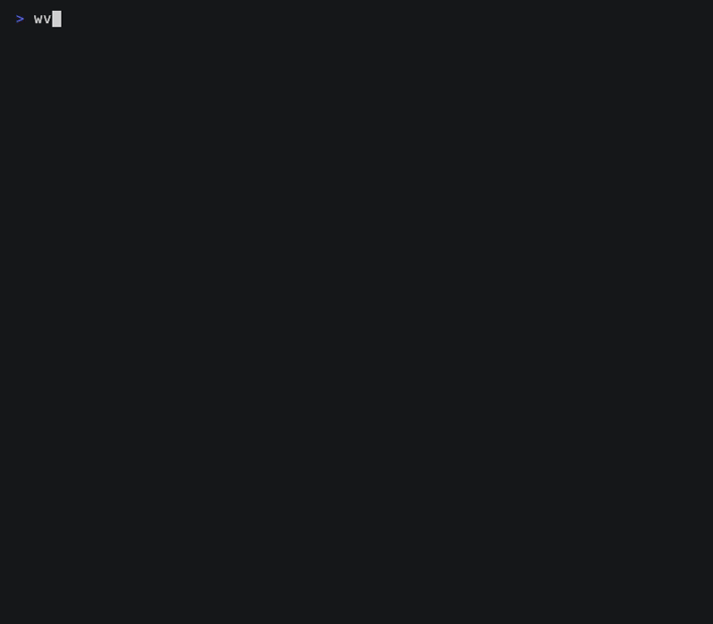

<p align="center">
  <a href="../README.md">English</a>
  &nbsp;·&nbsp;
  <strong>简体中文</strong>
</p>

<p align="center">
  
</p>

<p align="center">
  <a href="https://github.com/Menfre01/waveloom/releases/latest"></a>
  <a href="https://github.com/Menfre01/waveloom/actions/workflows/ci.yml"></a>
  <a href="https://github.com/Menfre01/waveloom/releases"></a>
  <a href="https://go.dev"></a>
  <a href="https://platform.deepseek.com"></a>
  <a href="../LICENSE"></a>
</p>

---

**DeepSeek 原生终端编码代理，围绕缓存经济学设计。** 前缀缓存架构让最长公共前缀跨轮次持续命中；LLM 自动按任务选模型——pro 做深度推理，flash 处理常规任务——最大化缓存命中，最小化 token 成本。专业级 TUI，`.claude/skills/` 和 `.claude.json` MCP 配置开箱兼容，零摩擦迁移。单一 Go 二进制。

<p align="center">
  
</p>

---

## 快速开始

### macOS / Linux

```sh
curl -fsSL https://raw.githubusercontent.com/Menfre01/waveloom/main/install.sh | sh
```

或通过 Homebrew：

```sh
brew install menfre01/tap/waveloom
```

> 支持 macOS / Linux / Windows，AMD64 & ARM64。安装到 `~/.local/bin`，无需 sudo。

### Windows

需要安装 [Git for Windows](https://git-scm.com/downloads/win)。打开 PowerShell 运行：

```powershell
powershell -c "irm https://raw.githubusercontent.com/Menfre01/waveloom/main/install.ps1 | iex"
```

> [!TIP]
> **Windows 上推荐使用 [WSL2](https://learn.microsoft.com/zh-cn/windows/wsl/install) 获得最佳体验。** 在 WSL2 内安装 Linux 版本，无需 Git Bash 转发层，终端渲染更流畅，shell 命令性能更佳。
>
> 选择 Git Bash？Waveloom 依赖 `bash.exe`，cmd 和 PowerShell 不支持。安装完成后，**打开 Git Bash** 执行下方命令。若找不到 `waveloom`，将 `%USERPROFILE%\.local\bin` 加入 Windows 系统 PATH（安装脚本已自动处理）。

### 配置

```sh
waveloom setup
waveloom
```

> [!IMPORTANT]
> API Key 直连 DeepSeek / Kimi / OpenAI，代码不经过第三方。写文件和执行命令前需要你确认。

---

## 和其他工具相比？

| | Waveloom | Claude Code | Reasonix |
|---|---|---|---|
| Skill/插件 | 开箱即用：`.claude/skills/` SKILL.md + `.claude/plugins/` 已装插件，9 个 frontmatter 字段（`$ARGUMENTS`、`paths`、`` !`cmd` `` 注入等） | 原生 SKILL.md + commands + 插件系统 | 13 个 frontmatter 字段，Skill body 无变量替换 |
| 缓存设计 | DeepSeek 前缀匹配：四级水位线（Snip → Prune → Summarize），压缩后字节永不变化 | Anthropic `cache_control`：`cache_edits` API，System Prompt 含动态段 | DeepSeek 前缀匹配：四级（notice → snip → compact → force），`session.Replace()` 触发 rewrite 版本号 |
| 上下文压缩 | 单调不变式 — `compactionDecisionSet` + 三游标，每条消息只压缩一次 | 每轮独立压缩，无持久性保证 | 前缀字节跨压缩保留，但无逐消息决策追踪 |
| Plan 模式 | Guard 限制只写 plan 文件，构建工具自动放行 | 仅 plan 文件可写，富交互审批 UI | `planmode.Policy` + bash/MCP 信任门；注入 Marker 字符串；无 plan 文件 |
| 子代理 | Fork(继承上下文)/ Cold:Evaluate(代码评审)• Explore(只读)• Verification(对抗验证) | Fork + Cold + In-process + Coordinator | `task` 工具嵌套 agent,后台任务通过 job manager |
| 运行时 | Go 单二进制 ~20MB，零依赖 | Node.js | Go 二进制 + Desktop 应用，外部 plugin 宿主 |
| MCP | 完整客户端（配置、传输、工具代理），与内置工具统一注册 | 原生 MCP 支持 | 原生 MCP 支持 |
| 权限模型 | 7 步决策管线,5 层工具输出安全(Unicode 清洗 → 注入扫描 → 边界标记 → 风险分级 → 安全截断),4 级命令安全分类(RiskNone/RiskLow/RiskMedium/RiskHigh) | 8 源规则合并 + LLM 分类器自动审批 | Policy + Approver,9 阶段执行管线,shellsafe readOnly 检测 |
| Hook | PreToolUse / PostToolUse / Notification / Stop / SubagentStop,permission_mode 字段,runtime fail-open | 原生 hooks:PreToolUse, PostToolUse 等 | — |
| TUI 打磨 | 流式推理、rich diff、权限对话框、`@` 模糊选择器、`/` 面板、i18n、主题切换 — 专业级 | 原生 TUI(Ink/React),标杆水平 | 功能完备的 TUI,不同 UX 范式 |
**选 Waveloom 如果**：追求专业终端体验，需要多 Provider 支持（DeepSeek / Kimi / OpenAI），想要 `.claude/skills/` + `.claude/plugins/` 开箱即用，不想白烧缓存未命中费用。
**选 Claude Code 如果**：用 Anthropic API、需要 coordinator 模式、重度依赖 Claude 生态。
**选 Reasonix 如果**：需要桌面 GUI、QQ Bot 集成、或更大的社区生态。

---

## 为什么选择 TUI

**Waveloom 是少数在终端交互打磨上不妥协的 DeepSeek 原生 Agent。** 流式推理 + 语法高亮、rich diff、权限确认对话框、`@` 模糊文件选择器、`/` 命令面板、主题切换、中英双语。大多数 DeepSeek Agent 的 TUI 只是 bare minimum — 纯文本流、无交互设计。跑一下就知道差距。

---

## 功能亮点

- **前缀缓存深度优化** — System Prompt 固定，消息只在末尾追加，四级水位线压缩后字节永不变化，最大公共前缀持续命中
- **权限安全模型** — 三级决策(allow / deny / ask),规则引擎支持模式匹配,底层 5 层工具输出安全管线(Unicode 清洗 → 注入扫描 → 边界标记 → 风险分级 → 安全截断)。写操作和命令执行需要你确认。
- **OS 级沙箱** — 可选执行隔离:bubblewrap(Linux)/ Seatbelt(macOS)实现只读根、工作区可写、凭据遮蔽(`~/.ssh`、钥匙串、token)、环境变量剥离、可配置环境变量注入(把 `GOPATH`/`GOMODCACHE`/`npm_config_cache` 等构建缓存重定向进工作区)与网络控制(`off`/`on`)。`--bypass-permissions` 自动激活;通过 `settings.json` 的 `"sandbox"` 段或 `--sandbox-network off|on` 配置。
- **Hook 系统** — PreToolUse / PostToolUse / Notification / Stop / SubagentStop 五种事件,支持 permission_mode 字段。Runtime fail-open,永不阻塞工具执行。通过 `settings.json` 配置。
- **会话持久恢复** — 关闭终端几天后 `waveloom --continue` 回来,Agent 记得所有上下文接着工作
- **Checkpoint/Rewind 时间旅行** — 回退到任意历史消息,同时恢复所有文件变更。Fork 模式原 session 完整保留,历史永不丢失
- **Plan 模式** — 先规划后执行的二阶段工作流:探索设计 → 审批 → 编码。`Shift+Tab` 一键进入/退出,Guard 写保护拦截。
- **子代理模型配置** — 在 `settings.json` 中设置 `"sub_model": "deepseek-v4-flash"`,explorer 子代理使用此轻量模型执行代码搜索和发现(约 2 倍便宜);evaluate 和 verification 子代理始终使用主模型保证审查质量。LLM 根据任务自主选择 pro/flash。
- **14 个内置工具** — `read` / `write` / `edit` / `bash` / `web_fetch` / `web_search` / `ask_user_question` / `enter_plan_mode` / `exit_plan_mode` / `skill` / `agent` / `kill_background_task` / `todo_create` / `todo_update`
- **i18n 多语言** — 完整中英双语界面,`--locale` CLI 参数 / `/locale` 命令,LANG 环境变量自动检测
---

## 常见问题

**Q: 怎么切换模型？**
输入 `/model` 选择，或 `waveloom --model deepseek-v4-flash`。

**Q: 怎么切换 Provider?**
输入 `/provider` 弹出交互式 Provider 选择器(↑↓ 选择 / Enter 确认 / Esc 取消),或 `/provider kimi` 直接切换。Profile 配置在 `settings.json` 的 `llm.profiles` 中。

**Q: API Key 安全吗？**
Key 存储在本地 `~/.waveloom/`，直连 DeepSeek / Kimi / OpenAI，不经过任何第三方服务器。

**Q: 怎么切换语言？**
输入 `/locale` 切换中英文界面，或 `waveloom --locale en-US`。设置自动保存到 `settings.json`。

**Q: 怎么为 explorer 子代理配置轻量模型?**
在 `settings.json` 的 `llm` 段中添加 `"sub_model": "deepseek-v4-flash"`。Explorer 子代理使用此模型执行代码搜索和发现任务——约 2 倍便宜。evaluate 和 verification 子代理始终使用主模型(`model`,如 `deepseek-v4-pro`)保证审查质量。无需运行时切换。

**Q: 支持哪些语言?**
Waveloom 适用于任何文本项目。编辑后 LSP 诊断自动验证 Go、Rust、TypeScript/JavaScript、C/C++ 代码。其他语言使用原生构建工具(`go build`、`npx tsc`、`cargo build`、`make` 等)。

---

## 文档

| 文档 | 内容 |
|------|------|
| [`usage`](./usage.md) | 交互模式、快捷键、Skill 系统 |
| [`install`](./install.md) | Homebrew / curl / 源码构建 / Shell 补全 |
| [`settings`](./settings.md) | API Key、模型、超时、压缩水位线、子代理模型 |
| [`prefix-cache`](./prefix-cache.md) | DeepSeek 缓存原理、四级水位线 |
| [`environment`](./environment.md) | 工具链探测 |
| [`mcp`](./mcp.md) | MCP 客户端、配置源、CLI 管理 |
| [`faq`](./faq.md) | 常见问题 |
| [`lsp`](./lsp.md) | LSP 诊断、语言检测、配置 |

---

## 开发

Go 1.25+，`make build` / `make test`。项目结构及贡献指南详见 [`CONTRIBUTING.md`](../CONTRIBUTING.md)。

基于 [Bubble Tea](https://github.com/charmbracelet/bubbletea)（TUI 框架）、
[Glamour](https://github.com/charmbracelet/glamour)（Markdown 渲染）、
[Lip Gloss](https://github.com/charmbracelet/lipgloss)（终端样式）构建 — [Charm](https://charm.sh) 生态项目。

