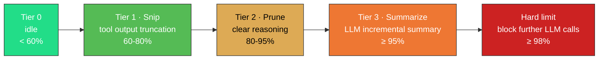

  <a href="./prefix-cache.md">简体中文</a>
  &nbsp;·&nbsp;
  <strong>English</strong>

---

# Context Management & Prefix Caching

DeepSeek's prefix cache mechanism: on each request, the API compares `messages[0]` onward against the previous request, finding the longest common prefix. The cached portion is billed at the cache-hit rate; the remainder at the standard rate. **The price gap between cache-hit and cache-miss is massive** — for V4-Flash and V4-Pro, cache-hit price is just **1/50 ~ 1/120** of the cache-miss price.

Waveloom systematically optimizes for this:

1. **System prompt fixed as `messages[0]`**: The first message never changes, no matter how long the conversation — ensuring the prefix starting point is always stable.
2. **Message history accumulated across turns**: Each turn appends to the end rather than resetting. The first N-1 turns become the prefix for turn N's request.
3. **Four-tier watermark compaction (Tier 0–3)**: As context utilization rises, history is compressed in stages. The key insight — **compacted byte content never changes again**. Once a message is truncated or replaced with a placeholder, it keeps the exact same byte representation in all future turns, so the prefix cache keeps hitting.
4. **Monotonic boundary guarantee**: The decision table (`compactionDecisionSet`) + triple cursor mechanism ensures each message is compacted exactly once — never modified repeatedly, which would invalidate the cache.

Cache hit rates are typically **95–99%**, meaning in a 1M-token context window, only 10K–50K tokens are billed at the standard rate. This is not luck — it's by architectural design.

> See [`specs/compaction.md`](../specs/compaction.md) — complete design of context compaction.
