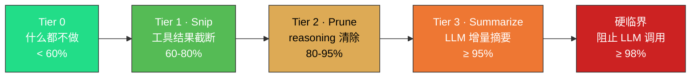

  <strong>简体中文</strong>
  &nbsp;·&nbsp;
  <a href="./prefix-cache.en.md">English</a>

---

# 上下文管理与前缀缓存

DeepSeek 的前缀缓存机制：每次请求时，API 从 `messages[0]` 开始逐条比对，找到与上次请求的最长公共前缀。命中部分按缓存价计费，未命中部分按标准价计费。**缓存命中与未命中的输入价格差异巨大**——以 V4-Flash 和 V4-Pro 为例，缓存命中价格仅为未命中的 **1/50 ~ 1/120**。

Waveloom 针对这一机制做了系统性的优化：

1. **System Prompt 固定为 `messages[0]`**：无论对话多长，第一条消息始终不变，确保公共前缀的起点稳定。
2. **消息历史跨轮累积不重置**：每轮对话追加到历史末尾，不做"每轮只传当前问题"的短视优化。这样前 N-1 轮的内容都是第 N 轮请求的前缀。
3. **四级水位线压缩（Tier 0-3）**：当上下文利用率上升时，分级压缩历史消息。关键在于——**压缩后的字节内容永不变化**。一旦某条消息被截断或替换为占位符，它在后续所有轮次中保持完全相同的字节表示，前缀缓存持续命中。
4. **单调边界保证**：压缩决策表（`compactionDecisionSet`）+ 双 cursor 机制确保每条消息只被压缩一次，不会反复修改导致缓存失效。

缓存命中率通常在 **95-99%**，意味着 100 万 Token 的上下文窗口中，实际按标准价计费的只有 1-5 万 Token。这不是偶然——是架构设计的结果。

> 详见 [`specs/compaction.md`](../specs/compaction.md) —— 上下文压缩的完整设计。
