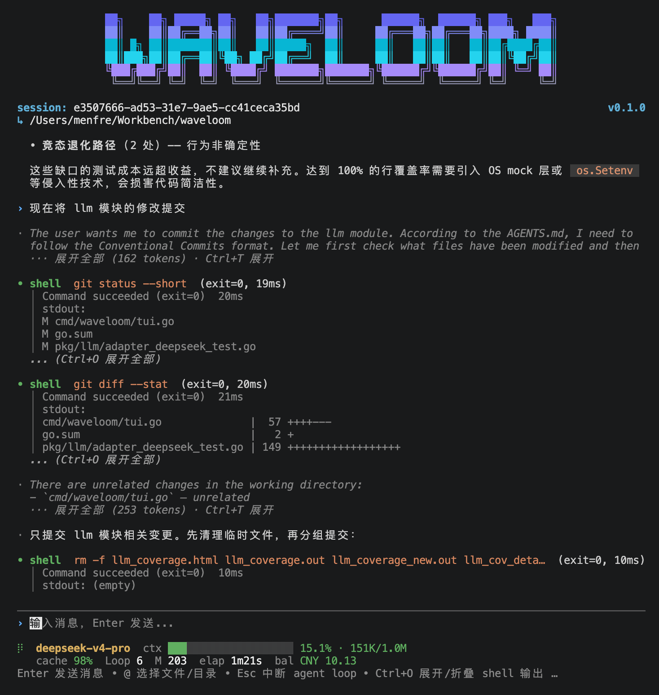

<p align="center">
  <a href="./usage.md">简体中文</a>
  &nbsp;·&nbsp;
  <strong>English</strong>
</p>

---

# Usage

## Interactive Mode

```sh
waveloom
```

Once in the TUI, type like a chat and press Enter to send. The agent autonomously invokes tools to read files, search code, edit, and run tests.

<p align="center">
  
</p>

The prefix character at the beginning of each line tells you **who is speaking**:

| Prefix | Role | Meaning |
|--------|------|---------|
| `›` | You | Your message, in blue |
| `·` / spinner | Assistant | AI reply, in green, Markdown rendered |
| `·` / spinner | Thought | AI's reasoning, in gray, collapsed to one line when done (`Tab` to focus + `Enter` to expand) |
| `•` / spinner | Tool | AI's actions (read, write, run), green = success / red = failure |

**Keyboard shortcuts**:

| Key | Action |
|-----|--------|
| `Enter` | Send message; type `exit` and Enter to quit |
| `Esc` | Interrupt running agent |
| `Esc+Esc` | Clear the input |
| `↑` `↓` | Idle: navigate input history; running / end of history: scroll conversation |
| `Ctrl+E` / `End` | Jump to bottom |
| `Tab` | Focus next interactive paragraph (thought / tool output) |
| `Shift+Tab` | Focus previous interactive paragraph; when idle, enter/exit Plan Mode |
| `Enter` | Expand/collapse the currently focused paragraph |
| `Ctrl+G` | Toggle theme (auto / dark / light / darkcolorblind / lightcolorblind) |
| `Ctrl+V` | Paste from clipboard |
| `?` | Show keyboard shortcut help |
| `Ctrl+C×2` | Double-tap to quit (prevents accidental exit) |
| `Shift + mouse drag` | Select text in terminal |
| `Mouse wheel` | Scroll 3 lines per tick |
The **footer status bar** shows: current model, context usage (progress bar), cache hit rate, loop count, balance.

## One-shot

```sh
waveloom "explain the design of pkg/llm/client.go"
waveloom --model deepseek-v4-pro "write unit tests for UserService"
echo "review the code under pkg/llm/" | waveloom
```

## Session Management

```sh
waveloom ls                     # List recent sessions
waveloom --continue             # Resume the most recent session
waveloom --resume <session-id>  # Resume a specific session
waveloom --name <name>          # Name a new session
```

## Skill Installation & Management

Install community skills from any git repository, pinned to an exact commit (`skill.lock.json`):

```sh
waveloom skill add https://github.com/user/skills.git@v1.2 --path packages/skills/review
waveloom skill list              # List all skills with their source (remote@commit or local)
waveloom skill update review     # Pull the latest commit on the recorded ref
waveloom skill remove review     # Remove (only skills installed via this command)
```

- `@ref` accepts branch / tag / commit SHA; defaults to `main`
- Installs to project-level `.waveloom/skills/` by default; pass `--global` for user-level `~/.waveloom/skills/`
- Manually created skills are not tracked by `skill.lock.json`; `remove` refuses to delete them

## @ File References

Type `@` in the input to open a fuzzy file picker (prefix > substring matching). `Tab` enters subdirectories. Selected file contents are automatically injected into the message context.

```
help me optimize the error handling in @pkg/auth/login.go
```

### AGENTS.md Auto-loading

## / Command Palette

Type `/` in the input to open the command palette with fuzzy search.

| Command | Alias | Description |
|---------|-------|-------------|
| `/new` | `/clear` | Create a new session |
| `/model` | — | Show or switch model, type to filter; press `e` in the picker to set thinking effort |
| `/rename` | — | Rename the current session |
| `/theme` | — | Select theme (auto / dark / light / darkcolorblind / lightcolorblind) |
| `/locale` | `/lang` | Switch language (zh-CN / en-US) |
| `/provider` | — | View or switch LLM provider (DeepSeek / Kimi / GLM / OpenAI) |
| `/rewind` | — | Rewind to a previous message (restores file state) |
| `/help` | — | Show all available commands |
Skills with `user-invocable: true` in `.claude/skills/` are automatically registered as `/` commands using the skill name. Additionally, skills/commands from installed Claude Code plugins are auto-discovered (via `~/.claude/plugins/installed_plugins.json` + `enabledPlugins` config).

## Plan Mode

Plan Mode is a two-stage "design first, implement later" workflow. Ideal for tasks involving 3+ files, architectural decisions, or multiple viable approaches.

**How to enter**:
- **Shortcut**: press `Shift+Tab` when idle (no paragraph focused) to enter directly
- **Agent-invoked**: LLM assesses task complexity and calls `enter_plan_mode`, which pops up a confirmation dialog

**In Plan Mode**:
- All tools remain visible, but `write` / `edit` are restricted to the plan file only
- Shell analysis commands (`go test`, `git log`, `npm ls`, etc.) are auto-allowed; dangerous commands are blocked
- LLM communicates with you continuously via `ask_user_question` to clarify requirements
- Plan content is written to `~/.waveloom/plans/<slug>.md`

**How to exit**:
- **Shortcut**: press `Shift+Tab` in plan mode with no focus, approve or reject in the dialog
- **Agent-invoked**: LLM calls `exit_plan_mode` when ready, same approval dialog appears
- Approved → returns to normal mode, LLM starts implementing
- Rejected → stays in plan mode, LLM revises based on feedback

The `▌Plan` indicator on the left of the input line shows you're in Plan Mode.

## Sandboxed execution

Waveloom provides OS-level execution isolation (bubblewrap on Linux / Seatbelt on macOS): read-only root, workspace-only writes, credential masking (`~/.ssh`, keychains, tokens, etc.), environment variable stripping, and controllable networking.

### Classic combo: sandbox + bypass-permissions + network on (CI / non-interactive)

```sh
waveloom --bypass-permissions --sandbox-network on "go build && go test"
```

What this combination gives you:

| Layer | Behavior |
|-------|----------|
| Permissions | `--bypass-permissions` → binary decision (DENY/ALLOW only, no prompts; deny rules and high-risk hard blocks still apply) |
| Sandbox | Auto-activated → commands run isolated (read-only root + workspace writes + credential masking + env stripping) |
| Network | `--sandbox-network on` → direct network inside the sandbox (dependency pulls, git fetch, gh, etc.); `off` (default) = fully offline |

> [!TIP]
> With network `on`, configure credential masking (`credentials.files` / `filesystem.denyRead` in `settings.json`) so unmasked user files can't be exfiltrated. Without it the sandbox still runs, but a warning is printed.

### Other common usages

```sh
# Sandbox + permission bypass + offline (local build/test, default network policy)
waveloom --bypass-permissions "make build && make test"

# TUI mode with explicit sandbox (requires "sandbox": {"enabled": true} in .waveloom/settings.json)
waveloom

# Escape hatch for docker / network-privileged commands (project-level .waveloom/settings.json):
# { "sandbox": { "excludedCommands": ["docker *"] } }
```

**Sample config** (`.waveloom/settings.json`):

```json
{
  "sandbox": {
    "enabled": true,
    "excludedCommands": ["docker *"],
    "env": {
      "GOPATH": "./.waveloom-gopath",
      "GOMODCACHE": "./.waveloom-gomodcache",
      "GOCACHE": "./.waveloom-gocache"
    },
    "network": { "mode": "on" },
    "credentials": { "files": ["~/.ssh", "~/.aws/credentials"] }
  }
}
```

> `sandbox.env` redirects build-tool caches into the writable workspace area (go's `GOPATH`/`GOMODCACHE`/`GOCACHE`, npm's `npm_config_cache`, etc.), avoiding host-cache write failures under the read-only root. Full field reference: [settings.en.md](settings.en.md#env-injection-inside-the-sandboxenv).

**Platform support**: Linux (bubblewrap, `apt install bubblewrap`) / macOS (Seatbelt, built-in) / Windows unsupported (use WSL2 for the Linux backend). When the backend is unavailable the sandbox degrades with a warning; `failIfUnavailable: true` turns that into a hard refusal to start.

### Linux first run: bubblewrap installation guide

bubblewrap is **not installed by default** on Linux — when the sandbox is first enabled and bwrap is missing, the startup log shows the install command for your distribution:

| Distro | Command |
|--------|---------|
| Ubuntu / Debian / Mint | `sudo apt install bubblewrap` |
| Fedora / RHEL / CentOS | `sudo dnf install bubblewrap` |
| Arch / Manjaro | `sudo pacman -S bubblewrap` |
| Alpine | `sudo apk add bubblewrap` |
| openSUSE | `sudo zypper install bubblewrap` |

> [!TIP]
> Systems with **Flatpak** usually already have bubblewrap (it's Flatpak's core sandbox dependency) — run `which bwrap` first; you may not need to install anything.

On Ubuntu 24.04+ if AppArmor blocks unprivileged user namespaces, follow the error output:

```sh
# Temporary
sudo sysctl -w kernel.apparmor_restrict_unprivileged_userns=0
# Permanent: install an AppArmor profile allowing bwrap userns (see error output)
```

### excludedCommands: classic escape-hatch scenarios

`excludedCommands` lets specific commands run **outside the sandbox** (bare), while permissions still pass through Guard (deny rules and high-risk hard blocks remain). Typical scenarios:

**1. docker (most common) — docker doesn't work inside the sandbox**

The sandbox masks `~/.docker/config.json` and restricts daemon socket access, so docker commands must run outside:

```json
{
  "sandbox": { "excludedCommands": ["docker *"] }
}
```

```sh
waveloom --bypass-permissions --sandbox-network on "docker build -t app . && docker push app"
```

> [!NOTE]
> In a compound command containing an escaped command (`A && docker ps && B`), the **whole command escapes the sandbox** — the model should run docker commands standalone and keep other commands sandboxed.

**2. Partial networking — allow only specific commands, keep the rest offline**

Instead of enabling `network.mode: on` globally, allow just a few commands to reach the network (e.g. `git push`, `npm install`):

```json
{
  "sandbox": {
    "excludedCommands": ["git push *", "npm install *"],
    "network": { "mode": "off" }
  }
}
```

Effect: all other sandboxed commands stay offline; only the escaped commands can use the network.

**3. Escape hatch — commands that fail inside the sandbox**

When a command fails inside the sandbox (with `allowUnsandboxedCommands` on by default), the output suggests adding it to `excludedCommands` and retrying; once you confirm the command is safe, configure it as shown.

### AGENTS.md Auto-loading

On startup, Waveloom discovers and loads `AGENTS.md` (search path: `~/.waveloom/AGENTS.md` → project root where `.git` lives → CWD), concatenating them from outer to inner as the first user message. The agent automatically follows project conventions, coding standards, and workflows defined therein.

### @ Expansion Inside AGENTS.md

`AGENTS.md` files also support `@` reference syntax, useful for splitting large convention docs into multiple files:

```
# AGENTS.md
@docs/coding-style.md
@docs/release-process.md
```

Waveloom expands `@` references within loaded AGENTS.md files. Multiple refs are expanded in order, with deduplication by path.

