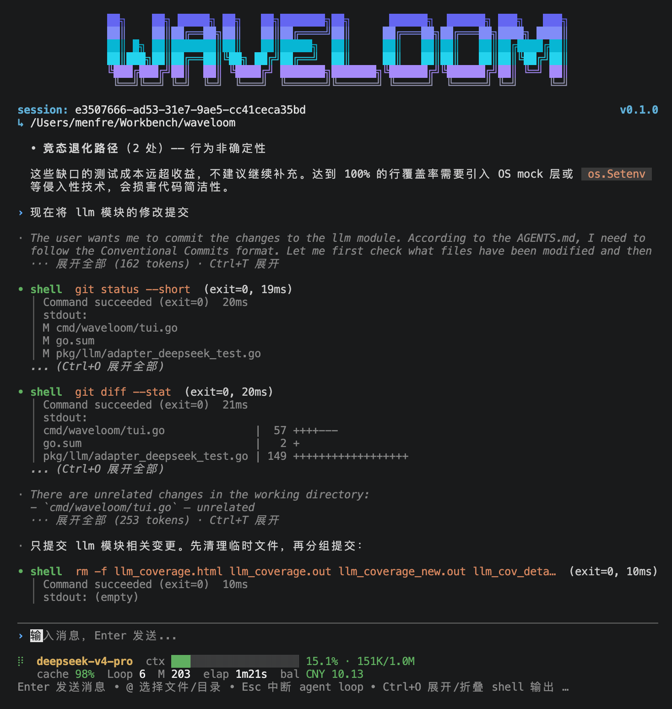

<p align="center">
  <strong>简体中文</strong>
  &nbsp;·&nbsp;
  <a href="./usage.en.md">English</a>
</p>

---

# 使用方式

## 交互模式

```sh
wvl
```

进入 TUI 后，像聊天一样打字，Enter 发送。Agent 会自主调用工具来读文件、搜代码、编辑、跑测试。

<p align="center">
  
</p>

每行开头的字符告诉你**谁在说话**：

| 前缀 | 角色 | 含义 |
|------|------|------|
| `›` | 你 | 你的消息，蓝色 |
| `·` / spinner | Assistant | AI 的回复，绿色，支持 Markdown 渲染 |
| `·` / spinner | Thought | AI 的思考过程，灰色，完成后自动折叠为一句话（`Ctrl+T` 展开） |
| `•` / spinner | 工具 | AI 的操作（读文件、写文件、跑命令），绿=成功 / 红=失败 |

**快捷键**：

| 按键 | 作用 |
|------|------|
| `Enter` | 发送消息 |
| `Esc` | 中断正在运行的 Agent |
| `↑` `↓` / `PgUp` `PgDn` | 滚动对话历史 |
| `Ctrl+E` / `End` | 跳到底部 |
| `Ctrl+T` | 展开/折叠最近一个 thought |
| `Ctrl+O` | 展开/折叠最近一个 tool 输出 |
| `Ctrl+G` | 切换主题（dark / light / auto） |
| `Ctrl+V` | 粘贴 |
| `Ctrl+C` | 退出 |

**底部状态栏**显示：当前模型、上下文用量（进度条）、缓存命中率、Loop 轮数、耗时、余额。

## 单次执行

```sh
wvl "解释 pkg/llm/client.go 的设计"
wvl --model deepseek-v4-pro "给 UserService 写单元测试"
echo "review pkg/llm/ 下的代码" | wvl
```

## 会话管理

```sh
wvl ls                     # 列出最近会话
wvl --continue             # 恢复最近一次会话
wvl --resume <session-id>  # 恢复指定会话
```

## @ 文件引用

在输入框里打 `@`，会弹出文件选择器，支持模糊过滤（前缀 > 子串匹配），`Tab` 进入子目录。选中的文件内容会自动注入到消息上下文。

```
帮我优化 @pkg/auth/login.go 的错误处理逻辑
```
