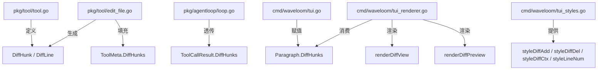

# diff-view: edit_file 统一 Diff 显示组件

> **状态：✅ 已实现** — 全链路已贯通（`buildDiffHunks` → `ToolMeta.DiffHunks` → `ToolCallResult.DiffHunks` → `Paragraph.DiffHunks` → `renderDiffView` / `renderDiffPreview`）。

## 一、问题分析

**现状**：`edit_file` 工具的 `renderReplacement()` 仅对比 `old_string` 和 `new_string` 本身，无上下文。TUI 展开后用户只能看到孤立的 `-/+` 行，无法判断改动在文件中的位置。

**目标**：新增一个专用的 **统一 Diff 视图组件**，以 `git diff -U3` 风格渲染改动，包含上下文行、行号、hunk 头，并用 Waveloom 色板着色。

## 二、数据流变更

当前链路：

```
edit_file.Execute()
  → ToolResult{Content: "✅ ...\n   --- Replacement ---\n- old\n+ new"}
  → ToolCallResult{Result: Content}          // Meta 丢弃
  → Paragraph{ToolResult: Content}           // TUI 解析字符串
```

**核心矛盾**：`Content` 同时服务两个消费者——**LLM**（只需简洁摘要）和 **TUI**（需要完整 diff）。把完整 unified diff 塞进 Content 会浪费 LLM token。

**方案**：将结构化 diff 数据放入 `ToolMeta`，沿链路透传到 `Paragraph`，TUI 从结构化数据渲染，LLM 继续使用精简 Content。

```
edit_file.Execute()
  → ToolResult{
        Content: "✅ Edited file: path\n   Replaced 1 occurrence\n   Lines: 42 → 43 (+1)",
        Meta: ToolMeta{
            DiffHunks: []DiffHunk{...},       // ← 新增
        },
    }
  → ToolCallResult{
        Result: Content,
        DiffHunks: Meta.DiffHunks,            // ← 新增透传
    }
  → Paragraph{
        ToolResult: Content,                  // LLM 用（精简）
        DiffHunks: DiffHunks,                 // TUI 用（结构化）
    }
```

## 三、新增 / 修改文件

| 文件 | 操作 | 说明 |
|------|------|------|
| `pkg/tool/tool.go` | **修改** | `ToolMeta` 新增 `DiffHunks []DiffHunk`；新增 `DiffHunk`、`DiffLine` 类型 |
| `pkg/tool/edit_file.go` | **修改** | `Execute()` 生成带上下文的 unified diff，填充 `Meta.DiffHunks`；`Content` 精简为单行摘要 |
| `pkg/agentloop/types.go` | **修改** | `ToolCallResult` 新增 `DiffHunks []tool.DiffHunk` |
| `pkg/agentloop/loop.go` | **修改** | 构造 `ToolCallResult` 时透传 `r.Meta.DiffHunks` |
| `cmd/waveloom/tui.go` | **修改** | `Paragraph` 新增 `DiffHunks []tool.DiffHunk`；`handleToolResult` 赋值 |
| `cmd/waveloom/tui_styles.go` | **修改** | 新增 diff 上下文行、hunk 头、行号、背景样式；`palette` 扩展 `DiffAddBg` / `DiffDelBg` |
| `cmd/waveloom/tui_renderer.go` | **修改** | 新增 `renderDiffView()` / `renderDiffPreview()`；移除对 edit_file 的字符串解析分支；`countDiffLines` 改为从 `DiffHunks` 计算 |
| `pkg/tool/edit_file_test.go` | **修改** | 新增 diff hunk 生成正确性测试 |
| `cmd/waveloom/tui_renderer_test.go` | **修改** | 新增 diff 视图渲染测试 |

## 四、组件边界与数据结构

### 4.1 `DiffHunk` 类型（`pkg/tool/tool.go`）

```go
// DiffLineKind 表示统一 diff 中一行的类型。
type DiffLineKind string

const (
    DiffAdd    DiffLineKind = "+" // 新增行
    DiffDel    DiffLineKind = "-" // 删除行
    DiffCtx    DiffLineKind = " " // 上下文行
    DiffHeader DiffLineKind = "@" // hunk 头
)

// DiffLine 表示统一 diff 中的一行。
type DiffLine struct {
    Kind    DiffLineKind
    Content string // 不含前缀的实际内容
    OldNum  int    // 旧文件行号（0 = 不适用）
    NewNum  int    // 新文件行号（0 = 不适用）
}

// DiffHunk 表示一个 diff 块（一段连续的变更 + 上下文）。
type DiffHunk struct {
    OldStart int        // 旧文件起始行号（1-based）
    OldCount int        // 旧文件覆盖行数
    NewStart int        // 新文件起始行号（1-based）
    NewCount int        // 新文件覆盖行数
    Heading  string     // hunk 头部函数上下文（如 "func main() {"）
    Lines    []DiffLine
}

// Stats 返回该 hunk 的增删统计。
func (h DiffHunk) Stats() (add, del int) {
    for _, l := range h.Lines {
        switch l.Kind {
        case DiffAdd:
            add++
        case DiffDel:
            del++
        }
    }
    return
}
```

### 4.2 工具层生成逻辑（`pkg/tool/edit_file.go`）

```
输入: old_string, new_string, 文件路径

1. 读取文件 → original
2. 定位 old_string 在 original 中的位置（strings.Index）
3. 计算行号映射：
   - oldStart = 行号(old_string 起始位置)
   - oldCount = 行数(old_string)
   - newCount = 行数(new_string)
4. 提取上下文：向前向后各 3 行（可配置 contextLines=3）
5. 构造 DiffHunk:
   - 上下文行 → DiffLine{Kind:" ", Content, OldNum, NewNum}
   - 删除行   → DiffLine{Kind:"-", Content, OldNum, NewNum:0}
   - 新增行   → DiffLine{Kind:"+", Content, OldNum:0, NewNum}
6. Content 精简：
   "✅ Edited file: path\n   Replaced 1 occurrence\n   +3 -1 lines"
```

**关键不变量**：

- `DiffHunks` 为 `nil` 表示该工具不产生 diff（非 edit_file 工具）
- 当 `replace_all=true` 时，每个替换位置各生成一个 `DiffHunk`
- 当匹配失败（no match / multiple match），`DiffHunks` 为 `nil`，TUI 回退到纯文本显示
- `Content` 永远不含 diff 细节（保持 LLM 上下文精简）

### 4.3 TUI 渲染组件

**折叠态预览** (`renderDiffPreview`)：

- 显示第一个 hunk 的前 3 行（与当前 `renderToolPreview` 行为一致）
- `+` 行绿色前景，`-` 行红色前景，` ` 行 muted
- 超出时显示 `... (Ctrl+O 展开全部)`

**展开态视图** (`renderDiffView`)：

- 每个 hunk 渲染一个 `@@` 头行（accent 色）
- 每行带行号列（muted 色，4 位右对齐）
- `-` 行：浅红背景 + 红色前景 + 旧行号
- `+` 行：浅绿背景 + 绿色前景 + 新行号
- ` ` 行：默认色 + 双行号
- hunk 之间空行分隔

**行号对齐示例**：

```
     │ @@ -10,6 +10,8 @@ func main() {
 10  │     fmt.Println("hello")
 11  │-    oldLine()
     │+    newLine1()
     │+    newLine2()
 12  │     fmt.Println("world")
```

- 旧行号仅在 `-` 行和上下文行显示
- 新行号仅在 `+` 行和上下文行显示
- 行号列统一宽度，由 `max(oldCount, newCount)` 动态计算

## 五、色板与样式扩展

新增样式定义（`tui_styles.go`）：

| 样式变量 | 颜色 | 用途 |
|----------|------|------|
| `styleDiffCtx` | `colorMuted` | diff 上下文行 |
| `styleDiffHeader` | `colorHeaderAccent` | hunk 头 `@@ ... @@` |
| `styleDiffAddBG` | `colorDiffAddBg` | `+` 行背景 |
| `styleDiffDelBG` | `colorDiffDelBg` | `-` 行背景 |
| `styleLineNum` | `colorGray` | 行号列 |

配色板扩展（`tui_styles.go` `palette` 结构体）：

```go
// diff 视图背景色
DiffAddBg color.Color
DiffDelBg color.Color
```

暗色/亮色色板值：

| 字段 | 暗色 | 亮色 |
|------|------|------|
| `DiffAddBg` | `#2a3a2a` | `#d8f0d8` |
| `DiffDelBg` | `#3a2a2a` | `#f0d8d8` |

## 六、折叠 / 展开行为

| 状态 | 行为 |
|------|------|
| `stateStreaming` | 显示 spinner + tool 名 + 参数（无 diff） |
| `stateDone`（折叠） | 显示摘要行 + 预览（前 3 行 diff） |
| `stateExpanded` | 显示摘要行 + 完整 diff 视图 |
| `stateError` | 红色错误信息（无 diff） |

当前 `stateDone` 即折叠态的逻辑保持。展开/折叠切换键保持 `Ctrl+O`。

## 七、与既有组件集成点

1. **`handleToolResult`**（tui.go）：从 `ToolCallResult.DiffHunks` 赋值到 `Paragraph.DiffHunks`
2. **`renderToolPara`**（tui_renderer.go）：根据 `p.DiffHunks != nil` 分流到新 diff 渲染路径
3. **`toolSuffix`**（tui_renderer.go）：`countDiffLines` 改为从 `p.DiffHunks` 直接计算 `added/removed`
4. **`syncThemeComponents`**（tui.go）：Glamour 样式刷新不受影响（diff 不经过 Glamour）

## 八、测试计划

| 测试文件 | 测试用例 | 内容 |
|----------|----------|------|
| `pkg/tool/edit_file_test.go` | `TestEditFileDiffHunks` | 验证 DiffHunks 结构正确性：行号映射、上下文行数、+/- 行归类 |
| `pkg/tool/edit_file_test.go` | `TestEditFileDiffHunksReplaceAll` | replace_all 时多个 hunk |
| `pkg/tool/edit_file_test.go` | `TestEditFileDiffHunksEmptyNew` | new_string 为空（纯删除）时 diff 结构 |
| `pkg/tool/edit_file_test.go` | `TestEditFileDiffHunksEmptyOld` | 参数校验阶段即报错，不生成 diff |
| `cmd/waveloom/tui_renderer_test.go` | `TestRenderDiffView` | 给定 fixture DiffHunks，验证渲染输出包含预期行号、着色标记 |
| `cmd/waveloom/tui_renderer_test.go` | `TestRenderDiffPreview` | 折叠态只显示前 3 行 |

## 九、验收标准

1. 执行 `edit_file` 后，TUI 中展开工具输出，看到带行号 + 上下文的统一 diff 视图
2. `+` 行绿色背景，`-` 行红色背景，上下文行灰色，`@@` 头 accent 色
3. 折叠态预览只显示前 3 行
4. `replace_all` 多匹配时每个匹配各一个 hunk
5. LLM 收到的 tool result Content 仍然精简（不含完整 diff）
6. `make test` 全部通过，无回归

## 十、Mermaid 数据流图

```mermaid
sequenceDiagram
    participant LLM
    participant Loop as agentloop
    participant Tool as edit_file
    participant TUI

    LLM->>Loop: tool_call(edit_file, {old, new, path})
    Loop->>Tool: Execute(params)
    Tool->>Tool: 读取文件 → 定位匹配 → 计算行号
    Tool->>Tool: 提取上下文 (±3 行) → 构造 DiffHunks
    Tool-->>Loop: ToolResult{Content(精简), Meta{DiffHunks}}
    Loop-->>TUI: ToolCallResult{Result, DiffHunks}
    TUI->>TUI: 折叠态: renderDiffPreview (前3行)
    TUI->>TUI: 展开态: renderDiffView (完整带行号)
    Loop-->>LLM: tool_result(Content 精简摘要)
```

## 十一、Mermaid 组件关系图


